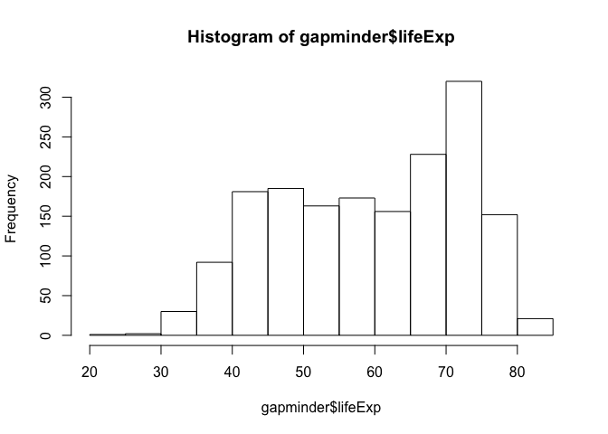

# Gapminder analysis
Gb  
2017-09-19  


```r
library(gapminder)
```


```r
library(tidyverse)
```

```
## Loading tidyverse: ggplot2
## Loading tidyverse: tibble
## Loading tidyverse: tidyr
## Loading tidyverse: readr
## Loading tidyverse: purrr
## Loading tidyverse: dplyr
```

```
## Conflicts with tidy packages ----------------------------------------------
```

```
## filter(): dplyr, stats
## lag():    dplyr, stats
```

```r
class(gapminder)
```

```
## [1] "tbl_df"     "tbl"        "data.frame"
```
####Questions about gapminder
#####gapminder is a data.frame
#####gapminder is a tibble

```r
str(gapminder)
```

```
## Classes 'tbl_df', 'tbl' and 'data.frame':	1704 obs. of  6 variables:
##  $ country  : Factor w/ 142 levels "Afghanistan",..: 1 1 1 1 1 1 1 1 1 1 ...
##  $ continent: Factor w/ 5 levels "Africa","Americas",..: 3 3 3 3 3 3 3 3 3 3 ...
##  $ year     : int  1952 1957 1962 1967 1972 1977 1982 1987 1992 1997 ...
##  $ lifeExp  : num  28.8 30.3 32 34 36.1 ...
##  $ pop      : int  8425333 9240934 10267083 11537966 13079460 14880372 12881816 13867957 16317921 22227415 ...
##  $ gdpPercap: num  779 821 853 836 740 ...
```
#####gapminder has 6 variables/columns
#####gapminder has 1704 rows/observations
#####facts about extent and size can be gather in more than one way.  If you want to have a quick glimpse about the dataset than str() is a useful function.  If you want to know specifically about columns, names of variables or look at the top of the bottom of the dataset than fuctions like ncol(), names(), length(), dim(), nrow(), head() or tail() could be useful
#####Data type of variables: country and continent are factors, year and population are integers and lifeExp and gdpPercap are numerical
***
####Exploring individual variables
#####Categorical data= continent, quantitative data= gdpPercapita
#####Values and range of each variable explored using summary, table, barplots and histograms


```r
summary(gapminder$continent)
```

```
##   Africa Americas     Asia   Europe  Oceania 
##      624      300      396      360       24
```

```r
table(gapminder$continent)
```

```
## 
##   Africa Americas     Asia   Europe  Oceania 
##      624      300      396      360       24
```

```r
barplot(table(gapminder$continent))
```

<!-- -->

#####For the continents variable, the number of countries in each continent varies from over 600+ in Africa to less than 30 in Oceania. This is also illustrated using a barplot.
 


```r
summary(gapminder$lifeExp)
```

```
##    Min. 1st Qu.  Median    Mean 3rd Qu.    Max. 
##   23.60   48.20   60.71   59.47   70.85   82.60
```

```r
table(gapminder$lifeExp)
```

```
## 
##   23.599   28.801       30   30.015   30.331   30.332    31.22   31.286 
##        1        1        1        1        1        1        1        1 
##    31.57   31.975   31.997   31.999   32.065     32.5   32.548   32.767 
##        1        1        1        1        1        1        1        1 
##   32.978   33.489   33.609   33.685   33.779   33.896    33.97       34 
##        1        1        1        1        1        1        1        1 
##    34.02   34.078   34.113   34.482   34.488   34.558   34.812   34.906 
##        1        1        1        1        1        1        1        1 
##   34.977    35.18   35.307     35.4   35.463   35.492   35.753   35.857 
##        1        1        1        1        1        1        1        1 
##   35.928   35.983   35.985   36.087   36.088   36.157   36.161   36.256 
##        1        1        1        1        1        1        1        1 
##   36.319   36.324   36.486   36.667   36.681   36.788   36.936   36.981 
##        1        1        1        1        1        1        1        1 
##   36.984   37.003   37.197   37.207   37.278   37.328   37.373   37.444 
##        1        1        1        1        1        1        1        1 
##   37.464   37.465   37.468   37.484   37.485   37.578   37.579   37.686 
##        1        1        1        1        1        1        1        1 
##   37.802   37.814   37.928   38.047   38.092   38.113   38.223   38.308 
##        1        1        1        1        1        1        1        1 
##   38.333    38.41   38.438   38.445    38.48   38.487   38.523   38.596 
##        1        1        1        1        1        1        1        1 
##   38.598   38.635   38.842   38.865   38.977   38.987   38.999   39.031 
##        1        1        1        1        1        1        1        1 
##   39.143   39.193   39.327   39.329   39.348    39.36   39.393   39.417 
##        1        1        1        1        1        1        1        1 
##   39.475   39.483   39.486   39.487   39.613   39.624   39.658   39.693 
##        1        1        1        2        1        1        1        1 
##   39.848   39.854   39.875   39.881   39.897   39.906   39.918   39.942 
##        1        1        1        1        1        1        1        1 
##   39.977   39.978   39.989       40   40.006   40.059    40.08   40.118 
##        1        1        1        1        1        1        1        1 
##   40.158   40.238   40.249   40.317   40.328   40.358   40.412   40.414 
##        1        1        1        1        1        1        1        1 
##   40.428   40.477   40.489   40.502   40.516   40.533   40.543   40.546 
##        1        1        1        1        1        1        1        1 
##   40.647   40.652   40.696   40.697   40.715   40.762   40.802   40.822 
##        1        1        1        1        1        1        1        1 
##   40.848    40.87   40.963   40.973   41.003   41.012    41.04   41.208 
##        1        1        1        1        1        1        1        1 
##   41.215   41.216   41.245   41.291   41.366   41.407   41.454   41.472 
##        1        1        1        1        1        1        1        1 
##   41.478     41.5   41.536   41.674   41.714   41.716   41.725   41.763 
##        1        1        1        1        1        1        1        1 
##   41.766   41.842    41.89   41.893   41.905   41.912   41.974   42.023 
##        1        1        1        1        1        1        1        1 
##   42.024   42.038   42.045   42.074   42.082   42.111   42.115   42.122 
##        1        1        1        1        1        1        1        1 
##   42.129   42.138   42.189   42.221   42.244    42.27   42.314   42.338 
##        1        1        1        1        1        1        1        1 
##   42.384    42.46   42.469   42.495   42.518   42.568   42.571   42.587 
##        1        1        1        1        1        1        1        1 
##   42.592   42.598   42.614   42.618   42.643   42.723   42.731   42.795 
##        1        1        1        1        1        1        1        1 
##   42.821   42.858   42.861   42.868   42.873   42.881   42.887   42.891 
##        1        1        1        1        1        1        1        1 
##   42.955   42.974       43   43.077   43.149   43.158    43.16   43.165 
##        1        1        1        1        1        1        1        1 
##   43.266   43.308   43.413   43.415   43.424   43.428   43.436   43.453 
##        1        1        1        1        1        1        1        1 
##   43.457   43.487   43.515   43.548   43.563   43.585    43.59   43.591 
##        1        1        1        1        1        1        1        1 
##   43.601   43.605   43.662   43.753   43.764   43.767   43.795   43.828 
##        1        1        1        1        1        1        1        1 
##   43.869    43.89   43.902   43.916   43.922   43.971       44    44.02 
##        1        1        1        1        1        1        1        1 
##   44.026   44.056   44.057   44.077     44.1   44.142   44.175   44.246 
##        1        1        1        1        1        2        1        1 
##   44.248   44.284   44.366   44.444   44.467   44.501 44.50136    44.51 
##        1        1        1        1        1        1        1        1 
##   44.514   44.535   44.555   44.578   44.593   44.598     44.6   44.665 
##        1        1        1        1        1        1        2        1 
##   44.686   44.736   44.741   44.779   44.799   44.851   44.852   44.869 
##        1        1        1        1        1        1        1        1 
##   44.873   44.885   44.916    44.93   44.966   44.992       45   45.009 
##        1        1        1        1        1        1        1        2 
##   45.032   45.047   45.053   45.083   45.108   45.226   45.248   45.252 
##        1        1        1        1        1        1        1        1 
##   45.262   45.289    45.32   45.326   45.344   45.363   45.415   45.423 
##        1        1        1        1        1        1        1        1 
##   45.432   45.504   45.548   45.552   45.557   45.569    45.58   45.642 
##        1        1        1        1        1        1        1        1 
##   45.664   45.669   45.671   45.678   45.685   45.757   45.815   45.826 
##        1        1        1        1        1        1        1        1 
##   45.883    45.91   45.914   45.928   45.936   45.964   45.989   46.023 
##        1        1        1        1        1        1        1        1 
##   46.027   46.066     46.1   46.137   46.218   46.242   46.243   46.263 
##        1        1        1        1        1        1        1        1 
##   46.289   46.344   46.364   46.388   46.452   46.453   46.462   46.471 
##        1        1        1        1        1        1        1        1 
##   46.472   46.519   46.608   46.633   46.634   46.684   46.714   46.748 
##        1        1        1        1        1        1        1        1 
##   46.769   46.775   46.809   46.832   46.859   46.881   46.886   46.923 
##        1        1        1        1        1        1        1        1 
##   46.954   46.988   46.992   47.014   47.049     47.1   47.181   47.193 
##        1        1        1        1        1        1        1        1 
##    47.35    47.36   47.383   47.391   47.412   47.453   47.457   47.464 
##        1        1        1        1        1        1        1        1 
##   47.471   47.472   47.495   47.545    47.62   47.622    47.67   47.747 
##        1        1        1        1        1        1        1        1 
##   47.752   47.768   47.784     47.8   47.804   47.808   47.813   47.838 
##        1        1        1        1        1        1        1        1 
##   47.924   47.949   47.985   47.991   48.041   48.042   48.051   48.072 
##        1        1        1        1        1        1        1        1 
##   48.079   48.091   48.122   48.126   48.127   48.159   48.211   48.245 
##        1        1        1        1        1        1        1        1 
##   48.251   48.284   48.295   48.303   48.328   48.357   48.386   48.388 
##        1        1        1        2        1        1        1        1 
##   48.435   48.437   48.451   48.463   48.466   48.492    48.57   48.576 
##        1        2        1        1        1        1        1        1 
##   48.632    48.69   48.812   48.825   48.879   48.944   48.945   48.969 
##        1        1        1        1        1        1        1        1 
##   49.096   49.113    49.19   49.203   49.265   49.293   49.325   49.339 
##        1        1        1        1        1        1        1        1 
##   49.348    49.35   49.355   49.379   49.396   49.402    49.42   49.517 
##        1        1        1        1        1        1        1        1 
##   49.552   49.557   49.579    49.58   49.594   49.618   49.651   49.759 
##        1        1        1        1        1        1        1        1 
##   49.767     49.8   49.801   49.828   49.849   49.856   49.875   49.901 
##        1        1        1        1        1        1        1        1 
##   49.903   49.919   49.923   49.951   49.991   50.009   50.016   50.023 
##        1        1        1        1        1        1        1        1 
##    50.04   50.056   50.107   50.227   50.254    50.26   50.305   50.324 
##        1        1        1        1        1        1        1        1 
##   50.335   50.338    50.35    50.43    50.44   50.469   50.485   50.525 
##        1        1        1        1        1        1        1        1 
## 50.54896   50.608   50.643    50.65   50.651   50.654   50.725   50.728 
##        1        1        1        1        2        1        1        1 
##   50.789   50.821   50.848   50.852   50.904   50.917   50.924   50.939 
##        1        1        1        1        1        1        1        2 
##   50.957   50.986   50.992   51.016   51.051   51.137   51.159   51.253 
##        1        1        1        1        1        1        1        1 
##   51.313   51.334   51.356   51.386   51.407   51.445   51.455   51.457 
##        1        1        1        1        1        1        1        1 
##   51.461   51.479   51.509    51.52   51.535   51.542   51.573   51.579 
##        1        1        1        1        1        1        1        1 
##   51.604   51.629   51.631   51.724   51.744   51.756   51.818   51.821 
##        1        1        1        1        1        1        1        1 
##   51.884   51.893   51.927   51.929    52.04   52.044   52.053   52.098 
##        1        1        1        1        1        1        1        1 
##   52.102   52.143   52.199   52.208   52.214   52.295   52.307   52.337 
##        1        1        1        1        1        1        1        1 
##   52.358   52.374   52.379   52.469   52.517   52.537   52.556   52.644 
##        1        1        1        1        1        2        1        1 
##   52.681   52.702   52.724   52.773    52.79   52.819   52.862   52.887 
##        1        1        1        1        1        1        1        1 
##   52.906   52.922   52.933   52.947   52.961   52.962    52.97    53.07 
##        1        1        1        1        1        1        1        1 
##   53.157   53.285   53.298   53.319   53.365   53.373   53.378   53.459 
##        1        1        1        1        1        1        1        1 
##   53.556   53.559   53.599    53.63   53.636   53.655   53.676   53.696 
##        1        1        1        1        1        1        1        1 
##   53.738   53.744   53.754    53.82   53.832   53.859   53.867   53.884 
##        1        1        1        1        1        1        1        1 
##   53.886   53.914   53.919   53.983   53.995   54.043   54.081    54.11 
##        1        1        1        1        1        1        1        1 
##   54.208   54.289   54.314   54.336   54.406   54.407   54.425   54.459 
##        1        1        1        1        1        1        1        1 
##   54.467   54.496   54.518    54.64   54.655   54.745   54.757   54.777 
##        1        1        1        1        1        1        1        1 
##   54.791   54.907   54.926   54.978   54.985   55.078   55.088   55.089 
##        1        1        1        1        1        1        1        1 
##    55.09   55.118   55.151    55.19   55.191    55.23   55.234    55.24 
##        1        1        1        1        1        1        1        1 
##   55.292   55.322   55.373   55.448   55.471   55.491   55.527   55.558 
##        1        1        1        1        1        1        1        1 
##   55.561   55.565   55.599   55.602   55.625   55.635   55.665   55.727 
##        1        1        1        1        1        1        1        1 
##   55.729    55.73   55.737   55.764   55.769   55.803   55.855   55.861 
##        1        1        1        1        1        1        1        1 
##   55.928   56.006   56.007   56.018   56.024   56.029   56.059   56.061 
##        1        1        1        1        1        1        1        1 
##   56.074   56.145   56.155   56.158   56.159   56.369   56.393   56.433 
##        1        1        1        1        1        1        1        1 
##   56.437    56.48   56.528   56.532   56.534   56.564   56.596   56.604 
##        1        1        1        1        1        1        1        1 
##   56.656   56.671   56.678   56.695   56.696   56.728   56.735   56.751 
##        1        1        1        1        1        1        1        1 
##   56.752   56.761   56.867   56.923   56.941    56.95   57.005   57.046 
##        1        1        1        1        1        1        1        1 
##    57.18   57.206   57.251   57.286   57.296   57.367   57.402   57.442 
##        1        1        1        1        1        1        1        1 
##    57.47   57.489   57.501   57.561   57.593   57.632   57.666   57.674 
##        2        1        1        1        1        1        1        1 
##   57.678   57.702   57.716   57.863   57.907   57.924   57.939   57.996 
##        1        1        1        1        1        1        1        1 
##   58.014    58.02   58.033    58.04   58.041   58.056   58.061   58.065 
##        1        1        1        1        1        1        1        1 
##   58.089   58.137   58.161   58.196   58.207   58.245   58.285   58.299 
##        1        2        1        1        1        1        1        1 
##   58.333   58.339 58.38112    58.39    58.42   58.447    58.45   58.453 
##        1        1        1        1        1        1        1        1 
##   58.474     58.5    58.53    58.55   58.553   58.556    58.69   58.766 
##        1        1        1        1        1        2        1        1 
##   58.796   58.811   58.816   58.909   58.968     59.1   59.164   59.201 
##        1        1        1        1        1        1        1        1 
##    59.28   59.285   59.298   59.319    59.32   59.339   59.371   59.412 
##        1        1        1        1        1        1        1        1 
##   59.421   59.426   59.443   59.448   59.461   59.489   59.504   59.507 
##        1        1        1        1        1        1        1        1 
##   59.545     59.6    59.62   59.631    59.65   59.685   59.723   59.797 
##        1        1        1        1        1        1        1        1 
##    59.82   59.837   59.908   59.923   59.942   59.957   59.963   60.022 
##        1        1        1        1        1        1        1        1 
##   60.026    60.06    60.11   60.137   60.187    60.19   60.222   60.223 
##        1        1        1        1        1        1        1        1 
##   60.236   60.246   60.308   60.328   60.351   60.363   60.377   60.396 
##        1        1        1        1        1        1        1        1 
##   60.405   60.413    60.43   60.461    60.47   60.523   60.542    60.66 
##        1        1        1        1        1        1        1        1 
##   60.765    60.77   60.782   60.834   60.835   60.838   60.909   60.916 
##        1        1        1        1        1        1        1        1 
##    60.96   61.036    61.05   61.134   61.195    61.21   61.271    61.31 
##        1        1        1        1        1        1        1        2 
##    61.34   61.366   61.368   61.406   61.448   61.456   61.484   61.489 
##        1        1        1        1        1        1        1        1 
##    61.51   61.557     61.6   61.623   61.685   61.728   61.765   61.788 
##        1        1        1        1        1        1        1        1 
##     61.8   61.817   61.818   61.888    61.93   61.999   62.008   62.013 
##        1        1        1        1        1        1        1        1 
##   62.038    62.05   62.069   62.082   62.094   62.155   62.192   62.247 
##        1        1        1        1        1        1        1        1 
##   62.325   62.351   62.361     62.4   62.485   62.494    62.61   62.612 
##        1        1        1        1        1        1        1        1 
##   62.649   62.677   62.681   62.698   62.728   62.742   62.745    62.82 
##        1        1        1        1        1        1        1        1 
##   62.842   62.879   62.944   62.974    63.01   63.012    63.03    63.04 
##        1        1        1        1        1        1        1        1 
##   63.062   63.108 63.11888   63.154   63.179   63.196     63.3   63.306 
##        1        1        1        1        1        1        1        1 
##   63.336   63.373   63.441   63.479    63.61   63.622   63.625   63.674 
##        1        1        1        1        1        1        1        1 
##   63.727   63.728   63.739   63.785   63.837    63.87   63.883 63.96736 
##        1        1        1        1        1        1        1        1 
##   63.983    64.03   64.048   64.062   64.071     64.1   64.134   64.151 
##        1        1        1        1        1        1        1        1 
##   64.164   64.266   64.274    64.28   64.337   64.342    64.36   64.361 
##        1        1        1        1        1        1        1        1 
##    64.39   64.399   64.406   64.492   64.531    64.59   64.597   64.624 
##        1        1        1        1        1        1        1        1 
##   64.698    64.75   64.766    64.77    64.79    64.82     64.9    64.93 
##        1        1        1        1        1        1        1        1 
##    64.94   64.951   65.032   65.033   65.042   65.044   65.142   65.152 
##        1        1        1        1        1        1        1        1 
##     65.2   65.205   65.246   65.256    65.39   65.393     65.4   65.421 
##        1        1        1        1        1        1        1        1 
##   65.424   65.483     65.5   65.525   65.528   65.554    65.57   65.593 
##        1        1        1        1        1        1        1        1 
##    65.61   65.634   65.712   65.742    65.77   65.798   65.799   65.815 
##        1        1        1        1        1        1        1        1 
##   65.843    65.86   65.869     65.9    65.94   65.949   66.041   66.046 
##        1        1        1        1        1        1        1        1 
##   66.071   66.084   66.099   66.146   66.216    66.22   66.234   66.295 
##        1        1        1        1        1        1        1        1 
##   66.322   66.353   66.399    66.41   66.458    66.55     66.6    66.61 
##        1        1        1        1        2        1        1        1 
##   66.653    66.66   66.662   66.711   66.798     66.8   66.803    66.87 
##        1        1        1        1        1        3        1        1 
##   66.874   66.894    66.91   66.914   66.974   66.983   67.044   67.046 
##        1        1        1        1        1        1        1        1 
##   67.052   67.057   67.064   67.065   67.123    67.13   67.159   67.178 
##        1        1        1        1        1        1        1        1 
##   67.217   67.231   67.274   67.297   67.298   67.378   67.405    67.41 
##        1        1        1        1        1        1        1        1 
##    67.45   67.456    67.48    67.49     67.5    67.51   67.521    67.64 
##        2        1        1        1        2        1        1        1 
##    67.65   67.659    67.66   67.662    67.69   67.712   67.727   67.734 
##        1        1        1        1        1        1        1        1 
##   67.744   67.768    67.81    67.84   67.849    67.85    67.86   67.926 
##        1        1        1        1        1        1        1        1 
##   67.946    67.96       68   68.015   68.042   68.225   68.253    68.29 
##        1        1        2        1        1        1        1        1 
##     68.3   68.386   68.421   68.426    68.44   68.457   68.468   68.481 
##        1        1        1        1        1        1        1        1 
##     68.5    68.54   68.557   68.564   68.565   68.588   68.673   68.681 
##        1        1        1        2        1        1        1        1 
##    68.69     68.7    68.73    68.74    68.75   68.755   68.757   68.768 
##        1        1        1        1        2        1        1        1 
##   68.832   68.835     68.9    68.93   68.976   68.978       69   69.011 
##        1        1        1        2        1        1        1        1 
##    69.03   69.052     69.1    69.12    69.15   69.152    69.17    69.18 
##        1        1        2        1        1        1        1        2 
##    69.21    69.24   69.249    69.26   69.292   69.343    69.36   69.388 
##        1        2        1        1        1        1        1        1 
##    69.39     69.4   69.451    69.46   69.465   69.481    69.49   69.498 
##        4        1        1        1        1        1        1        1 
##     69.5    69.51   69.521    69.53   69.535    69.54    69.58   69.582 
##        2        2        1        1        1        1        1        1 
##    69.61   69.613   69.615    69.62    69.66    69.69   69.718    69.72 
##        2        1        1        2        1        1        1        1 
##   69.745    69.76   69.772   69.806    69.81   69.819    69.82    69.83 
##        1        1        1        1        1        1        1        1 
##    69.86   69.862   69.885     69.9   69.906   69.942    69.95   69.957 
##        1        1        1        1        1        1        1        1 
##    69.96   69.978       70   70.001    70.11    70.14   70.162    70.19 
##        1        1        1        1        1        1        1        1 
##   70.198    70.21    70.25   70.259    70.26   70.265    70.29     70.3 
##        1        1        1        1        1        1        2        2 
##   70.303   70.313    70.32    70.33    70.35   70.379    70.38    70.41 
##        1        1        1        2        1        1        1        1 
##    70.42   70.426    70.45   70.457    70.46   70.472    70.51   70.533 
##        3        1        1        1        1        1        1        1 
##    70.56   70.565    70.59   70.616    70.63   70.636    70.64   70.647 
##        1        1        1        1        1        1        1        1 
##    70.65    70.67   70.672    70.69   70.693    70.71   70.723   70.734 
##        1        1        1        1        1        1        1        1 
##   70.736    70.75   70.755    70.76   70.774    70.78   70.795     70.8 
##        1        3        1        2        1        1        1        2 
##   70.805    70.81   70.815   70.836   70.845   70.847    70.85    70.87 
##        1        1        1        1        1        1        1        1 
##     70.9    70.93    70.94    70.96   70.964    70.97    70.98    70.99 
##        1        1        1        1        1        1        2        1 
##   70.994       71   71.006   71.028    71.04    71.06   71.063    71.08 
##        1        2        1        1        1        1        1        3 
##   71.096     71.1    71.14    71.15   71.164    71.19   71.197    71.21 
##        1        2        1        1        1        1        1        1 
##   71.218    71.24   71.263    71.28     71.3   71.309    71.32   71.322 
##        1        1        1        1        1        1        2        1 
##   71.338    71.34    71.36    71.38   71.421    71.43    71.44   71.455 
##        1        2        1        1        1        1        2        1 
##    71.52   71.523   71.527    71.55   71.555    71.58   71.581   71.626 
##        2        1        1        1        1        1        1        1 
##    71.63   71.659   71.682   71.688   71.752    71.76   71.766    71.77 
##        1        1        1        1        1        1        1        1 
##   71.777    71.81    71.86   71.868   71.878    71.89   71.913   71.918 
##        1        1        1        1        1        1        1        1 
##    71.93   71.938   71.954   71.973   71.993       72    72.01   72.028 
##        1        1        1        1        1        2        1        1 
##    72.03   72.047    72.13    72.14   72.146    72.16    72.17   72.178 
##        1        1        2        1        1        2        1        1 
##    72.19    72.22   72.232   72.235   72.244    72.25   72.262   72.301 
##        1        1        1        1        1        1        1        1 
##   72.312    72.34    72.35    72.37    72.38    72.39   72.396     72.4 
##        1        1        1        1        1        1        1        1 
##   72.462   72.476    72.49   72.492   72.499     72.5    72.52   72.527 
##        1        1        2        1        1        1        1        1 
##   72.535   72.567    72.59   72.601   72.649    72.67    72.71   72.737 
##        1        1        1        1        1        1        1        1 
##    72.75   72.752    72.76   72.766    72.77   72.777     72.8   72.801 
##        1        1        1        1        2        1        1        1 
##    72.88   72.889   72.899    72.95    72.96   72.961    72.99   73.005 
##        1        1        1        1        1        1        1        1 
##   73.017   73.042   73.044   73.053    73.06   73.066     73.1    73.18 
##        1        1        1        1        2        1        1        1 
##   73.213    73.23   73.244   73.275   73.338    73.37    73.38     73.4 
##        1        1        1        1        1        1        1        1 
##    73.42   73.422    73.44    73.45    73.47    73.48    73.49    73.56 
##        1        1        2        1        3        1        1        1 
##     73.6   73.615    73.64    73.67    73.68   73.717    73.73   73.738 
##        1        1        1        1        3        1        1        1 
##   73.747    73.75    73.78     73.8    73.82    73.83    73.84   73.911 
##        1        2        1        2        1        1        1        1 
##   73.923   73.925    73.93   73.952   73.981   74.002    74.01    74.04 
##        1        1        1        1        1        1        1        1 
##    74.06    74.08    74.09   74.101   74.126   74.143    74.16   74.173 
##        1        1        1        1        1        1        1        1 
##   74.174   74.193    74.21   74.223   74.241   74.249    74.26    74.32 
##        2        1        1        1        1        1        1        1 
##    74.34    74.36    74.39   74.414    74.45    74.46   74.543    74.55 
##        2        1        1        1        1        1        1        1 
##    74.63   74.647    74.65   74.663    74.67    74.69   74.712    74.72 
##        2        1        1        1        1        1        1        1 
##    74.74   74.752   74.772   74.795     74.8    74.83   74.847   74.852 
##        1        1        1        1        1        1        1        1 
##    74.86   74.865   74.876    74.89   74.902   74.917    74.94    74.98 
##        1        1        1        1        1        1        1        1 
##   74.994   75.007    75.02    75.13    75.19    75.24    75.25   75.307 
##        1        1        1        1        1        2        1        1 
##    75.32    75.33    75.35    75.37    75.38    75.39   75.435    75.44 
##        1        1        1        1        1        1        1        1 
##   75.445    75.45   75.467    75.51   75.537   75.563     75.6   75.635 
##        1        1        1        1        1        1        1        1 
##    75.64   75.651     75.7   75.713   75.744   75.748    75.76   75.788 
##        1        1        1        1        1        1        1        1 
##   75.816    75.89    75.97    76.04    76.05    76.07    76.09    76.11 
##        1        1        2        1        1        1        1        2 
##   76.122   76.151   76.156   76.195     76.2    76.21     76.3    76.32 
##        1        1        1        1        1        1        1        1 
##    76.33    76.34   76.384    76.42   76.423   76.442    76.46   76.486 
##        1        1        1        3        1        1        1        1 
##    76.66    76.67    76.81    76.83    76.86     76.9   76.904    76.93 
##        1        1        1        1        1        1        1        1 
##    76.99    77.03   77.045    77.11    77.13   77.158    77.18    77.19 
##        2        1        1        1        1        2        1        1 
##   77.218    77.23    77.26    77.29    77.31    77.32    77.34    77.41 
##        1        1        1        1        1        1        1        1 
##    77.42    77.44    77.46    77.51    77.53    77.55    77.56    77.57 
##        1        1        1        1        1        1        1        1 
##   77.588   77.601   77.778   77.783    77.86   77.869   77.926    77.95 
##        1        1        1        1        1        1        1        1 
##    78.03   78.098   78.123    78.16   78.242   78.256   78.269   78.273 
##        2        1        1        1        1        1        1        1 
##    78.32   78.332    78.37     78.4   78.471    78.53   78.553    78.61 
##        2        1        1        1        1        1        1        1 
##   78.623    78.64    78.67   78.746    78.77   78.782    78.82    78.83 
##        1        1        2        1        3        1        1        1 
##   78.885    78.95    78.98    79.05    79.11   79.313    79.36    79.37 
##        1        1        1        1        1        1        1        1 
##    79.39   79.406   79.425   79.441   79.483    79.59   79.696   79.762 
##        1        1        1        1        1        1        1        1 
##    79.77    79.78   79.829   79.972       80    80.04   80.196   80.204 
##        1        1        1        1        1        1        1        1 
##    80.24    80.37     80.5   80.546    80.62   80.653   80.657    80.69 
##        1        1        1        1        1        1        1        1 
##   80.745   80.884   80.941   81.235   81.495   81.701   81.757       82 
##        1        1        1        1        1        1        1        1 
##   82.208   82.603 
##        1        1
```

```r
hist(gapminder$lifeExp)
```

<!-- -->

#####For the life expectancy variable, the median is around 60 and the mean is 59 (using the summary function).  The maximum is 82 and the minimum is 27.  The spread is shown using the table and histogram, with higher frequency in the 40-80 year life expectancy range

***
####Explore various plot types
#####Scatterplot of two quantitative variables (lifeExp and gdpPerCapita)


```r
p <- ggplot(gapminder, aes(x=log10(gdpPercap), y=lifeExp))
p + geom_point (aes(colour=continent), alpha=0.5)
```

<!-- -->

***
####Plot of one quantitative variable
#####Densityplot of gdpPercap


```r
ggplot (gapminder, aes(x=log10(gdpPercap))) + geom_density()
```

<!-- -->

#####add colours for different continents


```r
ggplot (gapminder, aes(x=log10(gdpPercap), colour=continent)) + geom_density()
```

<!-- -->

#####Removed Oceania because it had very few datapoints


```r
ggplot (subset(gapminder, continent!= "Oceania"), aes(x=log10(gdpPercap), colour=continent)) + geom_density()
```

<!-- -->

#####Experimented with facet wrap and transparency as demonstrated in Jenny's ggplot tutorial
#####https://github.com/jennybc/ggplot2-tutorial/blob/master/gapminder-ggplot2-univariate-quantitative.md


```r
ggplot (subset(gapminder, continent!= "Oceania"), aes(x=log10(gdpPercap), fill=continent)) + geom_density(alpha=0.2)
```

<!-- -->

```r
ggplot(gapminder, aes(x=log10(gdpPercap))) + geom_density() + facet_wrap(~ continent)
```

<!-- -->

***
####Plot one quantitative variable and one categorical
#####Boxplot of European countries' gdpPercap by year


```r
ggplot (subset(gapminder, continent == "Europe"), aes(x=year, y=gdpPercap)) + geom_boxplot(aes(group=year))
```

<!-- -->

***
####Boxplot of Canada and the Ireland using piping together of filter and select
#####To keep my code tidy, I assigned my piped data to the variable z.  I filtered by Canada and Ireland and selected the data on the country name, year and gdpPercap.  I then tested for z to make sure all the data I wanted was there


```r
z= gapminder %>% 
  filter(country %in% c("Canada", "Ireland")) %>% 
  select (country, year, gdpPercap)
```

```r
z
```

```
## # A tibble: 24 x 3
##    country  year gdpPercap
##     <fctr> <int>     <dbl>
##  1  Canada  1952  11367.16
##  2  Canada  1957  12489.95
##  3  Canada  1962  13462.49
##  4  Canada  1967  16076.59
##  5  Canada  1972  18970.57
##  6  Canada  1977  22090.88
##  7  Canada  1982  22898.79
##  8  Canada  1987  26626.52
##  9  Canada  1992  26342.88
## 10  Canada  1997  28954.93
## # ... with 14 more rows
```

#####I assigned the z variable as my dataset when using ggplot and examined the change of the two countries' gdpPercap by year.  I assigned the variable p as my ggplot x and y data. To make it look more informative I assigned different colours for the two countries and included a line of best fit.  I used the geom_point and geom_smooth functions for the colours and line of best fit, and also utilized the resources from Jenny's [ggplot tutorial](https://github.com/jennybc/ggplot2-tutorial/blob/master/gapminder-ggplot2-scatterplot.md)


```r
p <- ggplot (z, aes(x=year, y=gdpPercap))
```

```r
p+ geom_point()
```

<!-- -->


```r
p + geom_point(aes(colour = country))
```

<!-- -->

```r
p + aes(colour = country) + geom_point() + geom_smooth(lwd= 2, se= FALSE)
```

```
## `geom_smooth()` using method = 'loess'
```

<!-- -->

***
###But I want to do more!
#####Afghanistan and Rwanda exercise


```r
filter(gapminder, country == c("Rwanda", "Afghanistan"))
```

```
## # A tibble: 12 x 6
##        country continent  year lifeExp      pop gdpPercap
##         <fctr>    <fctr> <int>   <dbl>    <int>     <dbl>
##  1 Afghanistan      Asia  1957  30.332  9240934  820.8530
##  2 Afghanistan      Asia  1967  34.020 11537966  836.1971
##  3 Afghanistan      Asia  1977  38.438 14880372  786.1134
##  4 Afghanistan      Asia  1987  40.822 13867957  852.3959
##  5 Afghanistan      Asia  1997  41.763 22227415  635.3414
##  6 Afghanistan      Asia  2007  43.828 31889923  974.5803
##  7      Rwanda    Africa  1952  40.000  2534927  493.3239
##  8      Rwanda    Africa  1962  43.000  3051242  597.4731
##  9      Rwanda    Africa  1972  44.600  3992121  590.5807
## 10      Rwanda    Africa  1982  46.218  5507565  881.5706
## 11      Rwanda    Africa  1992  23.599  7290203  737.0686
## 12      Rwanda    Africa  2002  43.413  7852401  785.6538
```

#####It appears the code is correct.  The filtered gapminder data describes all the data in the dataset for Afghanistan and Rwanda.

***
####Utilizing more dplyr functions
#####To utilize and learn more about dplyr functions I asked the following question and tried to work backward to find the data: What country experienced the sharpest 5-year increase in population?
######First I created a copy of gapminder so I could make changes to the tibble without effecting the data in the package

```r
edit_gap <- gapminder
```

```r
edit_gap
```

```
## # A tibble: 1,704 x 6
##        country continent  year lifeExp      pop gdpPercap
##         <fctr>    <fctr> <int>   <dbl>    <int>     <dbl>
##  1 Afghanistan      Asia  1952  28.801  8425333  779.4453
##  2 Afghanistan      Asia  1957  30.332  9240934  820.8530
##  3 Afghanistan      Asia  1962  31.997 10267083  853.1007
##  4 Afghanistan      Asia  1967  34.020 11537966  836.1971
##  5 Afghanistan      Asia  1972  36.088 13079460  739.9811
##  6 Afghanistan      Asia  1977  38.438 14880372  786.1134
##  7 Afghanistan      Asia  1982  39.854 12881816  978.0114
##  8 Afghanistan      Asia  1987  40.822 13867957  852.3959
##  9 Afghanistan      Asia  1992  41.674 16317921  649.3414
## 10 Afghanistan      Asia  1997  41.763 22227415  635.3414
## # ... with 1,694 more rows
```

#####Next I wanted select only the variables I am interested in using the group by function for continent and country.  At each step I am assigning a new variable (s1, s2 etc) to make it easy to follow along


```r
s1<- edit_gap %>%
  select (country, year, continent, pop) %>% 
  group_by(continent, country)
```


```r
s1
```

```
## # A tibble: 1,704 x 4
## # Groups:   continent, country [142]
##        country  year continent      pop
##         <fctr> <int>    <fctr>    <int>
##  1 Afghanistan  1952      Asia  8425333
##  2 Afghanistan  1957      Asia  9240934
##  3 Afghanistan  1962      Asia 10267083
##  4 Afghanistan  1967      Asia 11537966
##  5 Afghanistan  1972      Asia 13079460
##  6 Afghanistan  1977      Asia 14880372
##  7 Afghanistan  1982      Asia 12881816
##  8 Afghanistan  1987      Asia 13867957
##  9 Afghanistan  1992      Asia 16317921
## 10 Afghanistan  1997      Asia 22227415
## # ... with 1,694 more rows
```


#####Next I want to use mutate to make a new data point which will tell me how pop changed by year ((pop in year i)- (pop in year i - 1). This will mean that positive numbers will indicate that the population went up.  I am using the lag function which finds the change based on the datapoint before the point in question (eg. x - (x-1))


```r
s2<- s1 %>% 
  mutate(pop_delta = pop -lag(pop))
```


```r
s2
```

```
## # A tibble: 1,704 x 5
## # Groups:   continent, country [142]
##        country  year continent      pop pop_delta
##         <fctr> <int>    <fctr>    <int>     <int>
##  1 Afghanistan  1952      Asia  8425333        NA
##  2 Afghanistan  1957      Asia  9240934    815601
##  3 Afghanistan  1962      Asia 10267083   1026149
##  4 Afghanistan  1967      Asia 11537966   1270883
##  5 Afghanistan  1972      Asia 13079460   1541494
##  6 Afghanistan  1977      Asia 14880372   1800912
##  7 Afghanistan  1982      Asia 12881816  -1998556
##  8 Afghanistan  1987      Asia 13867957    986141
##  9 Afghanistan  1992      Asia 16317921   2449964
## 10 Afghanistan  1997      Asia 22227415   5909494
## # ... with 1,694 more rows
```


#####Next I want to retain the best pop change, which means the biggest value that is positive. For this I use the summarize function and the max function.  To exclude any missing numbers from the analysis I am using "na.rm= TRUE"


```r
s3 <- s2 %>% 
  summarize(best_pop_delta = max(pop_delta, na.rm = TRUE))
```


```r
s3
```

```
## # A tibble: 142 x 3
## # Groups:   continent [?]
##    continent                  country best_pop_delta
##       <fctr>                   <fctr>          <dbl>
##  1    Africa                  Algeria        3221203
##  2    Africa                   Angola        1554370
##  3    Africa                    Benin        1084409
##  4    Africa                 Botswana         193922
##  5    Africa             Burkina Faso        2074994
##  6    Africa                  Burundi        1369427
##  7    Africa                 Cameroon        1766305
##  8    Africa Central African Republic         431389
##  9    Africa                     Chad        1403068
## 10    Africa                  Comoros          96578
## # ... with 132 more rows
```

#####Arrange in descending order


```r
s3 %>% 
  arrange (desc(best_pop_delta))
```

```
## # A tibble: 142 x 3
## # Groups:   continent [5]
##    continent          country best_pop_delta
##       <fctr>           <fctr>          <dbl>
##  1      Asia            China      107480000
##  2      Asia            India       87000000
##  3      Asia         Pakistan       17838690
##  4      Asia        Indonesia       16618000
##  5  Americas    United States       16017571
##  6    Africa          Nigeria       15129890
##  7      Asia       Bangladesh       14791549
##  8  Americas           Brazil       14648988
##  9    Africa Congo, Dem. Rep.        9226907
## 10    Africa         Ethiopia        9089029
## # ... with 132 more rows
```

##### From this table I can see that the highest population growths from the gapminder data set.  The largest is China which grew over a 107M people in a span of five years. The top four are from Asia.  If I wanted to see the highest pop growth by continent I would first use filter and min rank to select the top entry of each group, which is convieniently put together in the function top n.  This lets you select for the top n rows and you assign the wt as being the newly created variable best_pop_delta


```r
s3 %>%
  top_n(1, wt = best_pop_delta) %>% 
  arrange (desc(best_pop_delta))
```

```
## # A tibble: 5 x 3
## # Groups:   continent [5]
##   continent       country best_pop_delta
##      <fctr>        <fctr>          <dbl>
## 1      Asia         China      107480000
## 2  Americas United States       16017571
## 3    Africa       Nigeria       15129890
## 4    Europe        Turkey        5552537
## 5   Oceania     Australia        1304736
```

##### From this you can see the sharpest population increases in the other continents, with the smallest occuring in Australia which is in Oceania.  
#####I really enjoyed this exercise, a modified version of which is in the [dplyr functions in a single dataset](http://stat545.com/block010_dplyr-end-single-table.html#grand-finale) on the stats 545 website


