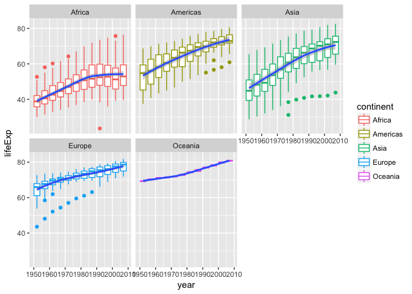

# Hw03
Gb  
2017-10-02  


```r
library(tidyverse)
```

```
## Loading tidyverse: ggplot2
## Loading tidyverse: tibble
## Loading tidyverse: tidyr
## Loading tidyverse: readr
## Loading tidyverse: purrr
## Loading tidyverse: dplyr
```

```
## Warning: package 'dplyr' was built under R version 3.4.2
```

```
## Conflicts with tidy packages ----------------------------------------------
```

```
## filter(): dplyr, stats
## lag():    dplyr, stats
```


```r
library(knitr)
```

```r
library(kableExtra)
```

***
#### Tasks
##### 1. Maximum and minimum of GDP per capita for all continents

###### To solve this question we need to consider what needs to be done.  We want to use the gapminder dataset, we should get rid of the variables we are no longer interested in using the select function (keep only continent, country, year and gdpPercap). Through piping we should make it so that the data is arranged with respect to the variable we are interested in (gdpPercap).  We want to know the max and min for each continent so next we should specify that the data should be grouped by continents.  Lastly we want to specify that we are only interested in the top entry for each group (continent) using the top_n function, where the weight will be the descending gdpPercap so we can see the minimum gdp by continent.  If we were looking at the max we would use wt as simply gdpPercap

###### For the tables generated I used knitr::kable and kableExtra to improve the appearance of my HTML tables.  I used the [cran website](https://cran.r-project.org/web/packages/kableExtra/vignettes/awesome_table_in_html.html) and bootstrap theme and the following customizations: striped rows, hover (for a change in row colour when the mouse hovers) and condensed to make the row height shorter.

```r
min_gdp <- gapminder %>% 
  select(continent, country, year, gdpPercap) %>% 
  arrange(gdpPercap) %>% 
  group_by(continent) %>% 
  top_n(1, wt=desc(gdpPercap))
```

```r
min_gdp%>% 
   kable("html") %>% 
  kable_styling(bootstrap_options = c("striped", "hover", "condensed"))
```

<table class="table table-striped table-hover table-condensed" style="margin-left: auto; margin-right: auto;">
<thead><tr>
<th style="text-align:left;"> continent </th>
   <th style="text-align:left;"> country </th>
   <th style="text-align:right;"> year </th>
   <th style="text-align:right;"> gdpPercap </th>
  </tr></thead>
<tbody>
<tr>
<td style="text-align:left;"> Africa </td>
   <td style="text-align:left;"> Congo, Dem. Rep. </td>
   <td style="text-align:right;"> 2002 </td>
   <td style="text-align:right;"> 241.1659 </td>
  </tr>
<tr>
<td style="text-align:left;"> Asia </td>
   <td style="text-align:left;"> Myanmar </td>
   <td style="text-align:right;"> 1952 </td>
   <td style="text-align:right;"> 331.0000 </td>
  </tr>
<tr>
<td style="text-align:left;"> Europe </td>
   <td style="text-align:left;"> Bosnia and Herzegovina </td>
   <td style="text-align:right;"> 1952 </td>
   <td style="text-align:right;"> 973.5332 </td>
  </tr>
<tr>
<td style="text-align:left;"> Americas </td>
   <td style="text-align:left;"> Haiti </td>
   <td style="text-align:right;"> 2007 </td>
   <td style="text-align:right;"> 1201.6372 </td>
  </tr>
<tr>
<td style="text-align:left;"> Oceania </td>
   <td style="text-align:left;"> Australia </td>
   <td style="text-align:right;"> 1952 </td>
   <td style="text-align:right;"> 10039.5956 </td>
  </tr>
</tbody>
</table>

###### Based on common sense we would expect that the minimum gdp by continent is likely early on the in the series (as there has been mostly positive economic growth over the decades) and we can see that for three out of the five continents the minimum gdpPercap is from the first year of data, 1952.  For the other two continents natural disasters and war can explain why the minimum gdpPercap experienced in Haiti and the DRC are more recent.


```r
min_gdp %>% 
  ggplot(aes(x= continent, y=gdpPercap)) + geom_col()
```

<!-- -->


```r
max_gdp <- gapminder %>% 
  select(continent, country, year, gdpPercap) %>% 
  arrange(gdpPercap) %>% 
  group_by(continent) %>% 
  top_n(1, wt=gdpPercap)
```

```r
max_gdp%>% 
   kable("html") %>% 
  kable_styling(bootstrap_options = c("striped", "hover", "condensed"))
```

<table class="table table-striped table-hover table-condensed" style="margin-left: auto; margin-right: auto;">
<thead><tr>
<th style="text-align:left;"> continent </th>
   <th style="text-align:left;"> country </th>
   <th style="text-align:right;"> year </th>
   <th style="text-align:right;"> gdpPercap </th>
  </tr></thead>
<tbody>
<tr>
<td style="text-align:left;"> Africa </td>
   <td style="text-align:left;"> Libya </td>
   <td style="text-align:right;"> 1977 </td>
   <td style="text-align:right;"> 21951.21 </td>
  </tr>
<tr>
<td style="text-align:left;"> Oceania </td>
   <td style="text-align:left;"> Australia </td>
   <td style="text-align:right;"> 2007 </td>
   <td style="text-align:right;"> 34435.37 </td>
  </tr>
<tr>
<td style="text-align:left;"> Americas </td>
   <td style="text-align:left;"> United States </td>
   <td style="text-align:right;"> 2007 </td>
   <td style="text-align:right;"> 42951.65 </td>
  </tr>
<tr>
<td style="text-align:left;"> Europe </td>
   <td style="text-align:left;"> Norway </td>
   <td style="text-align:right;"> 2007 </td>
   <td style="text-align:right;"> 49357.19 </td>
  </tr>
<tr>
<td style="text-align:left;"> Asia </td>
   <td style="text-align:left;"> Kuwait </td>
   <td style="text-align:right;"> 1957 </td>
   <td style="text-align:right;"> 113523.13 </td>
  </tr>
</tbody>
</table>

###### The maximum gdpPercap by continent reveals that three out of the five values are from the last year of data (2007) which is what we would expect based on a general trend of increased economic growth and gdp since this data begins in 1952. The two other countries recognized for thier maximum gdpPercap are Libya and Kuwait.  Both are oil states that experienced either a low population or a period of political stability which explain why their maximum gdpPercap were experienced further in the past.


```r
max_gdp %>% 
  ggplot(aes(x= continent, y=gdpPercap)) + geom_col()
```

<!-- -->

***
#### 2. Look at the spread of GDP per capita within continents

###### To look at the spread of GDP per capita we need to calculate for the statistics that tell us most about the spread of data.  These statistics are minimum, maximum, mean, median and standard deviation.  While these are easy to calculate for the whole dataset using the summary function and querying for gapminder$gdpPercapita, this does not show us the spread by continent.  In order to calculate the spread of gdp Per capita within continets we will use piping to group by continents, and then summarize for variables the we assigned for minimum, maximum, mean, median and standard deviation.  I have also included the count of the number of countries within each continent so we can see the amount of data used to calculate the spread. 

###### From the table below we can see the greatest spread of gdp per capita is in Asia.  This is because it has the highest standard deviation, that is the highest amount of variability in the dataset.  A standard deviation of over 14,000 for Asia indicates that there is greater spread around the mean than, for example, Africa which only has a standard deviation of 2827.


```r
sp1<- gapminder %>% 
  group_by(continent) %>% 
  summarize( min_gdpPercap= min(gdpPercap), max_gdpPercap=max(gdpPercap), mean_gdpPercap= mean(gdpPercap), median_gdpPercap = median(gdpPercap), sd_gdpPercap= sd(gdpPercap), 
             n_countries= length(gdpPercap))
```

```r
sp1%>% 
   kable("html") %>% 
  kable_styling(bootstrap_options = c("striped", "hover", "condensed"))
```

<table class="table table-striped table-hover table-condensed" style="margin-left: auto; margin-right: auto;">
<thead><tr>
<th style="text-align:left;"> continent </th>
   <th style="text-align:right;"> min_gdpPercap </th>
   <th style="text-align:right;"> max_gdpPercap </th>
   <th style="text-align:right;"> mean_gdpPercap </th>
   <th style="text-align:right;"> median_gdpPercap </th>
   <th style="text-align:right;"> sd_gdpPercap </th>
   <th style="text-align:right;"> n_countries </th>
  </tr></thead>
<tbody>
<tr>
<td style="text-align:left;"> Africa </td>
   <td style="text-align:right;"> 241.1659 </td>
   <td style="text-align:right;"> 21951.21 </td>
   <td style="text-align:right;"> 2193.755 </td>
   <td style="text-align:right;"> 1192.138 </td>
   <td style="text-align:right;"> 2827.930 </td>
   <td style="text-align:right;"> 624 </td>
  </tr>
<tr>
<td style="text-align:left;"> Americas </td>
   <td style="text-align:right;"> 1201.6372 </td>
   <td style="text-align:right;"> 42951.65 </td>
   <td style="text-align:right;"> 7136.110 </td>
   <td style="text-align:right;"> 5465.510 </td>
   <td style="text-align:right;"> 6396.764 </td>
   <td style="text-align:right;"> 300 </td>
  </tr>
<tr>
<td style="text-align:left;"> Asia </td>
   <td style="text-align:right;"> 331.0000 </td>
   <td style="text-align:right;"> 113523.13 </td>
   <td style="text-align:right;"> 7902.150 </td>
   <td style="text-align:right;"> 2646.787 </td>
   <td style="text-align:right;"> 14045.373 </td>
   <td style="text-align:right;"> 396 </td>
  </tr>
<tr>
<td style="text-align:left;"> Europe </td>
   <td style="text-align:right;"> 973.5332 </td>
   <td style="text-align:right;"> 49357.19 </td>
   <td style="text-align:right;"> 14469.476 </td>
   <td style="text-align:right;"> 12081.749 </td>
   <td style="text-align:right;"> 9355.213 </td>
   <td style="text-align:right;"> 360 </td>
  </tr>
<tr>
<td style="text-align:left;"> Oceania </td>
   <td style="text-align:right;"> 10039.5956 </td>
   <td style="text-align:right;"> 34435.37 </td>
   <td style="text-align:right;"> 18621.609 </td>
   <td style="text-align:right;"> 17983.304 </td>
   <td style="text-align:right;"> 6358.983 </td>
   <td style="text-align:right;"> 24 </td>
  </tr>
</tbody>
</table>


```r
gapminder %>%
  ggplot(aes(year, log10(gdpPercap), group=country)) + facet_wrap(~continent) + geom_line(aes(colour=continent))
```

<!-- -->

###### Looking at the spaghetti plots we can see that the highest spread of gdp per capita occurs in Asia where there are countries at the extremes of high and low, although the general trend is toward increase gdp per capita over time.  In continents like the Americas and Europe there is less variance between countries in terms of gdp per capita (ie. all the countries lines are much closer and denser) and the trends for both are for increased gdp per capita over time.  We can also show this for each continent using a geom_smooth function to add a line of best fit


```r
gapminder %>%
  ggplot(aes(year, log10(gdpPercap), group=country)) + facet_wrap(~continent) + geom_line(aes(colour=continent)) + geom_smooth(aes(group= continent), method= "lm", se = FALSE)
```

<!-- -->

###### The slope of these lines of best fit indicate that the highest gdpPercapita growth can be seen in Asia, Europe and Oceania.

***

#### 3. Report the absolute and/or relative abundance of countries with low life expectancy over time by continent: Compute some measure of worldwide life expectancy. Then determine how many countries on each continent have a life expectancy less than this benchmark, for each year.

###### Deciding on a measure for worldwide life expectancy: I decided on using the median for life expectancy as the benchmark. I think a median value is a great measure, and less affected by extremes in the data (of which there are many in this global dataset). To calculate the median life expectancy I decided to select for only the variables I am interested in (continent, country, year, life expectancy).  Then I used the mutate function to add a new variable, median life expectancy.


```r
s1<- gapminder %>%
  select (continent, country, year, lifeExp) %>% 
  mutate(median_LE= median(lifeExp))
```


```r
head(s1)%>% 
   kable("html") %>% 
  kable_styling(bootstrap_options = c("striped", "hover", "condensed"))
```

<table class="table table-striped table-hover table-condensed" style="margin-left: auto; margin-right: auto;">
<thead><tr>
<th style="text-align:left;"> continent </th>
   <th style="text-align:left;"> country </th>
   <th style="text-align:right;"> year </th>
   <th style="text-align:right;"> lifeExp </th>
   <th style="text-align:right;"> median_LE </th>
  </tr></thead>
<tbody>
<tr>
<td style="text-align:left;"> Asia </td>
   <td style="text-align:left;"> Afghanistan </td>
   <td style="text-align:right;"> 1952 </td>
   <td style="text-align:right;"> 28.801 </td>
   <td style="text-align:right;"> 60.7125 </td>
  </tr>
<tr>
<td style="text-align:left;"> Asia </td>
   <td style="text-align:left;"> Afghanistan </td>
   <td style="text-align:right;"> 1957 </td>
   <td style="text-align:right;"> 30.332 </td>
   <td style="text-align:right;"> 60.7125 </td>
  </tr>
<tr>
<td style="text-align:left;"> Asia </td>
   <td style="text-align:left;"> Afghanistan </td>
   <td style="text-align:right;"> 1962 </td>
   <td style="text-align:right;"> 31.997 </td>
   <td style="text-align:right;"> 60.7125 </td>
  </tr>
<tr>
<td style="text-align:left;"> Asia </td>
   <td style="text-align:left;"> Afghanistan </td>
   <td style="text-align:right;"> 1967 </td>
   <td style="text-align:right;"> 34.020 </td>
   <td style="text-align:right;"> 60.7125 </td>
  </tr>
<tr>
<td style="text-align:left;"> Asia </td>
   <td style="text-align:left;"> Afghanistan </td>
   <td style="text-align:right;"> 1972 </td>
   <td style="text-align:right;"> 36.088 </td>
   <td style="text-align:right;"> 60.7125 </td>
  </tr>
<tr>
<td style="text-align:left;"> Asia </td>
   <td style="text-align:left;"> Afghanistan </td>
   <td style="text-align:right;"> 1977 </td>
   <td style="text-align:right;"> 38.438 </td>
   <td style="text-align:right;"> 60.7125 </td>
  </tr>
</tbody>
</table>


###### Based on this calculation, the median life expectancy for the global dataset is 60.71 years.

###### Next I wanted find out how many countries on each continent had a life expectancy less than the benchmark for each year. I use the dataset I generated (s1) and group by continent and year because I want to know how many countries for each continent have a life expectancy less than the median by year. I then used the mutate function to create a new variable (Below_medLE) which the product of subtracting the median life expectancy from the life expectancy of each country by year.  Next I filtered only for the data points where Below_medLE was less than zero ie. the life expectancy in that country for that year was less than zero.  Finally I used summarize to count all the countries below the median life expectancy (n_countries_below_medLE) that would group by continent and year.


```r
s2 <- s1 %>% 
  group_by(continent, year) %>% 
  mutate (Below_medLE= lifeExp-median_LE) %>% 
  filter (Below_medLE <= 0) %>% 
  summarize(n_countries_below_medLE= length(Below_medLE))
```

```r
head(s2)%>% 
   kable("html") %>% 
  kable_styling(bootstrap_options = c("striped", "hover", "condensed"))
```

<table class="table table-striped table-hover table-condensed" style="margin-left: auto; margin-right: auto;">
<thead><tr>
<th style="text-align:left;"> continent </th>
   <th style="text-align:right;"> year </th>
   <th style="text-align:right;"> n_countries_below_medLE </th>
  </tr></thead>
<tbody>
<tr>
<td style="text-align:left;"> Africa </td>
   <td style="text-align:right;"> 1952 </td>
   <td style="text-align:right;"> 52 </td>
  </tr>
<tr>
<td style="text-align:left;"> Africa </td>
   <td style="text-align:right;"> 1957 </td>
   <td style="text-align:right;"> 52 </td>
  </tr>
<tr>
<td style="text-align:left;"> Africa </td>
   <td style="text-align:right;"> 1962 </td>
   <td style="text-align:right;"> 52 </td>
  </tr>
<tr>
<td style="text-align:left;"> Africa </td>
   <td style="text-align:right;"> 1967 </td>
   <td style="text-align:right;"> 51 </td>
  </tr>
<tr>
<td style="text-align:left;"> Africa </td>
   <td style="text-align:right;"> 1972 </td>
   <td style="text-align:right;"> 50 </td>
  </tr>
<tr>
<td style="text-align:left;"> Africa </td>
   <td style="text-align:right;"> 1977 </td>
   <td style="text-align:right;"> 50 </td>
  </tr>
</tbody>
</table>

###### This table shows us the number of countries by continent by year that had life expectancies that were less than the benchmark of the median life expectancy of the dataset.

###### Next we should plot this data using ggplot2.  We want how the continents did with regards to the number of countries under the benchmark overtime


```r
s2 %>%
  ggplot(aes(x=year, y=n_countries_below_medLE)) + geom_point (aes(colour=continent)) + geom_line(aes(colour=continent))
```

<!-- -->

###### From this plot we can see that there were only two continents remaining in 2007 with countries that had life expectancies less than the median of 60.71 years (Africa and Asia).  In 1952 all continents except Oceania had countries with life expectancies less than 60.71 years but these were reduced to zero by 1976 in Europe and 2002 in the Americas.
***

#### 4. How is life expectancy changing over time on different continents?

###### To look at how life expectancy is changing over time on different continents I thought it would be best to construct a table that showed the mean life expectancy by continent by year.  I used the [following website](https://learningstatisticswithr.wordpress.com/2012/11/28/a-simple-way-to-calculate-group-means-in-r/) to learn about the aggregate function which was very useful for this problem!


```r
y1<- aggregate(formula=lifeExp~continent+year,
            data=gapminder,
            FUN=mean) %>% 
  arrange(continent)
```

```r
head(y1)%>% 
   kable("html") %>% 
  kable_styling(bootstrap_options = c("striped", "hover", "condensed"))
```

<table class="table table-striped table-hover table-condensed" style="margin-left: auto; margin-right: auto;">
<thead><tr>
<th style="text-align:left;"> continent </th>
   <th style="text-align:right;"> year </th>
   <th style="text-align:right;"> lifeExp </th>
  </tr></thead>
<tbody>
<tr>
<td style="text-align:left;"> Africa </td>
   <td style="text-align:right;"> 1952 </td>
   <td style="text-align:right;"> 39.13550 </td>
  </tr>
<tr>
<td style="text-align:left;"> Africa </td>
   <td style="text-align:right;"> 1957 </td>
   <td style="text-align:right;"> 41.26635 </td>
  </tr>
<tr>
<td style="text-align:left;"> Africa </td>
   <td style="text-align:right;"> 1962 </td>
   <td style="text-align:right;"> 43.31944 </td>
  </tr>
<tr>
<td style="text-align:left;"> Africa </td>
   <td style="text-align:right;"> 1967 </td>
   <td style="text-align:right;"> 45.33454 </td>
  </tr>
<tr>
<td style="text-align:left;"> Africa </td>
   <td style="text-align:right;"> 1972 </td>
   <td style="text-align:right;"> 47.45094 </td>
  </tr>
<tr>
<td style="text-align:left;"> Africa </td>
   <td style="text-align:right;"> 1977 </td>
   <td style="text-align:right;"> 49.58042 </td>
  </tr>
</tbody>
</table>

###### While this shows us the mean life expectancy for each continent at each time point, we may be also interested in seeing how the life expectancy changes over time.  Using the lag() function we can see the change in life expectancy between time intervals.


```r
y1 %>% 
  arrange(continent) %>% 
  mutate(lifeExp_growth= lifeExp- lag(lifeExp)) %>% 
   kable("html") %>% 
  kable_styling(bootstrap_options = c("striped", "hover", "condensed"))
```

<table class="table table-striped table-hover table-condensed" style="margin-left: auto; margin-right: auto;">
<thead><tr>
<th style="text-align:left;"> continent </th>
   <th style="text-align:right;"> year </th>
   <th style="text-align:right;"> lifeExp </th>
   <th style="text-align:right;"> lifeExp_growth </th>
  </tr></thead>
<tbody>
<tr>
<td style="text-align:left;"> Africa </td>
   <td style="text-align:right;"> 1952 </td>
   <td style="text-align:right;"> 39.13550 </td>
   <td style="text-align:right;"> NA </td>
  </tr>
<tr>
<td style="text-align:left;"> Africa </td>
   <td style="text-align:right;"> 1957 </td>
   <td style="text-align:right;"> 41.26635 </td>
   <td style="text-align:right;"> 2.1308462 </td>
  </tr>
<tr>
<td style="text-align:left;"> Africa </td>
   <td style="text-align:right;"> 1962 </td>
   <td style="text-align:right;"> 43.31944 </td>
   <td style="text-align:right;"> 2.0530962 </td>
  </tr>
<tr>
<td style="text-align:left;"> Africa </td>
   <td style="text-align:right;"> 1967 </td>
   <td style="text-align:right;"> 45.33454 </td>
   <td style="text-align:right;"> 2.0150962 </td>
  </tr>
<tr>
<td style="text-align:left;"> Africa </td>
   <td style="text-align:right;"> 1972 </td>
   <td style="text-align:right;"> 47.45094 </td>
   <td style="text-align:right;"> 2.1164038 </td>
  </tr>
<tr>
<td style="text-align:left;"> Africa </td>
   <td style="text-align:right;"> 1977 </td>
   <td style="text-align:right;"> 49.58042 </td>
   <td style="text-align:right;"> 2.1294808 </td>
  </tr>
<tr>
<td style="text-align:left;"> Africa </td>
   <td style="text-align:right;"> 1982 </td>
   <td style="text-align:right;"> 51.59287 </td>
   <td style="text-align:right;"> 2.0124423 </td>
  </tr>
<tr>
<td style="text-align:left;"> Africa </td>
   <td style="text-align:right;"> 1987 </td>
   <td style="text-align:right;"> 53.34479 </td>
   <td style="text-align:right;"> 1.7519231 </td>
  </tr>
<tr>
<td style="text-align:left;"> Africa </td>
   <td style="text-align:right;"> 1992 </td>
   <td style="text-align:right;"> 53.62958 </td>
   <td style="text-align:right;"> 0.2847885 </td>
  </tr>
<tr>
<td style="text-align:left;"> Africa </td>
   <td style="text-align:right;"> 1997 </td>
   <td style="text-align:right;"> 53.59827 </td>
   <td style="text-align:right;"> -0.0313077 </td>
  </tr>
<tr>
<td style="text-align:left;"> Africa </td>
   <td style="text-align:right;"> 2002 </td>
   <td style="text-align:right;"> 53.32523 </td>
   <td style="text-align:right;"> -0.2730385 </td>
  </tr>
<tr>
<td style="text-align:left;"> Africa </td>
   <td style="text-align:right;"> 2007 </td>
   <td style="text-align:right;"> 54.80604 </td>
   <td style="text-align:right;"> 1.4808077 </td>
  </tr>
<tr>
<td style="text-align:left;"> Americas </td>
   <td style="text-align:right;"> 1952 </td>
   <td style="text-align:right;"> 53.27984 </td>
   <td style="text-align:right;"> -1.5261985 </td>
  </tr>
<tr>
<td style="text-align:left;"> Americas </td>
   <td style="text-align:right;"> 1957 </td>
   <td style="text-align:right;"> 55.96028 </td>
   <td style="text-align:right;"> 2.6804400 </td>
  </tr>
<tr>
<td style="text-align:left;"> Americas </td>
   <td style="text-align:right;"> 1962 </td>
   <td style="text-align:right;"> 58.39876 </td>
   <td style="text-align:right;"> 2.4384800 </td>
  </tr>
<tr>
<td style="text-align:left;"> Americas </td>
   <td style="text-align:right;"> 1967 </td>
   <td style="text-align:right;"> 60.41092 </td>
   <td style="text-align:right;"> 2.0121600 </td>
  </tr>
<tr>
<td style="text-align:left;"> Americas </td>
   <td style="text-align:right;"> 1972 </td>
   <td style="text-align:right;"> 62.39492 </td>
   <td style="text-align:right;"> 1.9840000 </td>
  </tr>
<tr>
<td style="text-align:left;"> Americas </td>
   <td style="text-align:right;"> 1977 </td>
   <td style="text-align:right;"> 64.39156 </td>
   <td style="text-align:right;"> 1.9966400 </td>
  </tr>
<tr>
<td style="text-align:left;"> Americas </td>
   <td style="text-align:right;"> 1982 </td>
   <td style="text-align:right;"> 66.22884 </td>
   <td style="text-align:right;"> 1.8372800 </td>
  </tr>
<tr>
<td style="text-align:left;"> Americas </td>
   <td style="text-align:right;"> 1987 </td>
   <td style="text-align:right;"> 68.09072 </td>
   <td style="text-align:right;"> 1.8618800 </td>
  </tr>
<tr>
<td style="text-align:left;"> Americas </td>
   <td style="text-align:right;"> 1992 </td>
   <td style="text-align:right;"> 69.56836 </td>
   <td style="text-align:right;"> 1.4776400 </td>
  </tr>
<tr>
<td style="text-align:left;"> Americas </td>
   <td style="text-align:right;"> 1997 </td>
   <td style="text-align:right;"> 71.15048 </td>
   <td style="text-align:right;"> 1.5821200 </td>
  </tr>
<tr>
<td style="text-align:left;"> Americas </td>
   <td style="text-align:right;"> 2002 </td>
   <td style="text-align:right;"> 72.42204 </td>
   <td style="text-align:right;"> 1.2715600 </td>
  </tr>
<tr>
<td style="text-align:left;"> Americas </td>
   <td style="text-align:right;"> 2007 </td>
   <td style="text-align:right;"> 73.60812 </td>
   <td style="text-align:right;"> 1.1860800 </td>
  </tr>
<tr>
<td style="text-align:left;"> Asia </td>
   <td style="text-align:right;"> 1952 </td>
   <td style="text-align:right;"> 46.31439 </td>
   <td style="text-align:right;"> -27.2937261 </td>
  </tr>
<tr>
<td style="text-align:left;"> Asia </td>
   <td style="text-align:right;"> 1957 </td>
   <td style="text-align:right;"> 49.31854 </td>
   <td style="text-align:right;"> 3.0041503 </td>
  </tr>
<tr>
<td style="text-align:left;"> Asia </td>
   <td style="text-align:right;"> 1962 </td>
   <td style="text-align:right;"> 51.56322 </td>
   <td style="text-align:right;"> 2.2446788 </td>
  </tr>
<tr>
<td style="text-align:left;"> Asia </td>
   <td style="text-align:right;"> 1967 </td>
   <td style="text-align:right;"> 54.66364 </td>
   <td style="text-align:right;"> 3.1004170 </td>
  </tr>
<tr>
<td style="text-align:left;"> Asia </td>
   <td style="text-align:right;"> 1972 </td>
   <td style="text-align:right;"> 57.31927 </td>
   <td style="text-align:right;"> 2.6556291 </td>
  </tr>
<tr>
<td style="text-align:left;"> Asia </td>
   <td style="text-align:right;"> 1977 </td>
   <td style="text-align:right;"> 59.61056 </td>
   <td style="text-align:right;"> 2.2912873 </td>
  </tr>
<tr>
<td style="text-align:left;"> Asia </td>
   <td style="text-align:right;"> 1982 </td>
   <td style="text-align:right;"> 62.61794 </td>
   <td style="text-align:right;"> 3.0073830 </td>
  </tr>
<tr>
<td style="text-align:left;"> Asia </td>
   <td style="text-align:right;"> 1987 </td>
   <td style="text-align:right;"> 64.85118 </td>
   <td style="text-align:right;"> 2.2332424 </td>
  </tr>
<tr>
<td style="text-align:left;"> Asia </td>
   <td style="text-align:right;"> 1992 </td>
   <td style="text-align:right;"> 66.53721 </td>
   <td style="text-align:right;"> 1.6860303 </td>
  </tr>
<tr>
<td style="text-align:left;"> Asia </td>
   <td style="text-align:right;"> 1997 </td>
   <td style="text-align:right;"> 68.02052 </td>
   <td style="text-align:right;"> 1.4833030 </td>
  </tr>
<tr>
<td style="text-align:left;"> Asia </td>
   <td style="text-align:right;"> 2002 </td>
   <td style="text-align:right;"> 69.23388 </td>
   <td style="text-align:right;"> 1.2133636 </td>
  </tr>
<tr>
<td style="text-align:left;"> Asia </td>
   <td style="text-align:right;"> 2007 </td>
   <td style="text-align:right;"> 70.72848 </td>
   <td style="text-align:right;"> 1.4946061 </td>
  </tr>
<tr>
<td style="text-align:left;"> Europe </td>
   <td style="text-align:right;"> 1952 </td>
   <td style="text-align:right;"> 64.40850 </td>
   <td style="text-align:right;"> -6.3199848 </td>
  </tr>
<tr>
<td style="text-align:left;"> Europe </td>
   <td style="text-align:right;"> 1957 </td>
   <td style="text-align:right;"> 66.70307 </td>
   <td style="text-align:right;"> 2.2945667 </td>
  </tr>
<tr>
<td style="text-align:left;"> Europe </td>
   <td style="text-align:right;"> 1962 </td>
   <td style="text-align:right;"> 68.53923 </td>
   <td style="text-align:right;"> 1.8361667 </td>
  </tr>
<tr>
<td style="text-align:left;"> Europe </td>
   <td style="text-align:right;"> 1967 </td>
   <td style="text-align:right;"> 69.73760 </td>
   <td style="text-align:right;"> 1.1983667 </td>
  </tr>
<tr>
<td style="text-align:left;"> Europe </td>
   <td style="text-align:right;"> 1972 </td>
   <td style="text-align:right;"> 70.77503 </td>
   <td style="text-align:right;"> 1.0374333 </td>
  </tr>
<tr>
<td style="text-align:left;"> Europe </td>
   <td style="text-align:right;"> 1977 </td>
   <td style="text-align:right;"> 71.93777 </td>
   <td style="text-align:right;"> 1.1627333 </td>
  </tr>
<tr>
<td style="text-align:left;"> Europe </td>
   <td style="text-align:right;"> 1982 </td>
   <td style="text-align:right;"> 72.80640 </td>
   <td style="text-align:right;"> 0.8686333 </td>
  </tr>
<tr>
<td style="text-align:left;"> Europe </td>
   <td style="text-align:right;"> 1987 </td>
   <td style="text-align:right;"> 73.64217 </td>
   <td style="text-align:right;"> 0.8357667 </td>
  </tr>
<tr>
<td style="text-align:left;"> Europe </td>
   <td style="text-align:right;"> 1992 </td>
   <td style="text-align:right;"> 74.44010 </td>
   <td style="text-align:right;"> 0.7979333 </td>
  </tr>
<tr>
<td style="text-align:left;"> Europe </td>
   <td style="text-align:right;"> 1997 </td>
   <td style="text-align:right;"> 75.50517 </td>
   <td style="text-align:right;"> 1.0650667 </td>
  </tr>
<tr>
<td style="text-align:left;"> Europe </td>
   <td style="text-align:right;"> 2002 </td>
   <td style="text-align:right;"> 76.70060 </td>
   <td style="text-align:right;"> 1.1954333 </td>
  </tr>
<tr>
<td style="text-align:left;"> Europe </td>
   <td style="text-align:right;"> 2007 </td>
   <td style="text-align:right;"> 77.64860 </td>
   <td style="text-align:right;"> 0.9480000 </td>
  </tr>
<tr>
<td style="text-align:left;"> Oceania </td>
   <td style="text-align:right;"> 1952 </td>
   <td style="text-align:right;"> 69.25500 </td>
   <td style="text-align:right;"> -8.3936000 </td>
  </tr>
<tr>
<td style="text-align:left;"> Oceania </td>
   <td style="text-align:right;"> 1957 </td>
   <td style="text-align:right;"> 70.29500 </td>
   <td style="text-align:right;"> 1.0400000 </td>
  </tr>
<tr>
<td style="text-align:left;"> Oceania </td>
   <td style="text-align:right;"> 1962 </td>
   <td style="text-align:right;"> 71.08500 </td>
   <td style="text-align:right;"> 0.7900000 </td>
  </tr>
<tr>
<td style="text-align:left;"> Oceania </td>
   <td style="text-align:right;"> 1967 </td>
   <td style="text-align:right;"> 71.31000 </td>
   <td style="text-align:right;"> 0.2250000 </td>
  </tr>
<tr>
<td style="text-align:left;"> Oceania </td>
   <td style="text-align:right;"> 1972 </td>
   <td style="text-align:right;"> 71.91000 </td>
   <td style="text-align:right;"> 0.6000000 </td>
  </tr>
<tr>
<td style="text-align:left;"> Oceania </td>
   <td style="text-align:right;"> 1977 </td>
   <td style="text-align:right;"> 72.85500 </td>
   <td style="text-align:right;"> 0.9450000 </td>
  </tr>
<tr>
<td style="text-align:left;"> Oceania </td>
   <td style="text-align:right;"> 1982 </td>
   <td style="text-align:right;"> 74.29000 </td>
   <td style="text-align:right;"> 1.4350000 </td>
  </tr>
<tr>
<td style="text-align:left;"> Oceania </td>
   <td style="text-align:right;"> 1987 </td>
   <td style="text-align:right;"> 75.32000 </td>
   <td style="text-align:right;"> 1.0300000 </td>
  </tr>
<tr>
<td style="text-align:left;"> Oceania </td>
   <td style="text-align:right;"> 1992 </td>
   <td style="text-align:right;"> 76.94500 </td>
   <td style="text-align:right;"> 1.6250000 </td>
  </tr>
<tr>
<td style="text-align:left;"> Oceania </td>
   <td style="text-align:right;"> 1997 </td>
   <td style="text-align:right;"> 78.19000 </td>
   <td style="text-align:right;"> 1.2450000 </td>
  </tr>
<tr>
<td style="text-align:left;"> Oceania </td>
   <td style="text-align:right;"> 2002 </td>
   <td style="text-align:right;"> 79.74000 </td>
   <td style="text-align:right;"> 1.5500000 </td>
  </tr>
<tr>
<td style="text-align:left;"> Oceania </td>
   <td style="text-align:right;"> 2007 </td>
   <td style="text-align:right;"> 80.71950 </td>
   <td style="text-align:right;"> 0.9795000 </td>
  </tr>
</tbody>
</table>

###### From this table we can see the the life expectancy in Africa grew by an average of 2 extra years over each five year period until 1992 when this growth in life expectancy slowed down. The period from 1992-2007 saw uneven growth in life expectancy for the continent. The Americas saw the mean life expectancy growth by an extra year or two for each five year period up until 2007.Asia also saw healthy gains of 1-3 years since 1952. Europe, which started with a higher mean life expectancy, saw slower but positive growth over the years. This is the same for Oceania.


###### To look at change in life expectancies over time I used boxplots because it was both a nice change from a spaghetti plot and also showed how the cohort of countries by continent changed every five years. We can see that the intrepretations we made from the table are visualized in the figure below.


```r
gapminder %>% 
  ggplot (aes(year, lifeExp)) + facet_wrap(~continent) + geom_boxplot(aes(group=year, colour=continent))
```

<!-- -->

###### To visualize the trends we can use geom_smooth to create a regressive line of best fit.  The figures below show that are interpretations of the table are correct.  There was growth of the average life expenctancy in Africa, but it slowed down since the 1990s. Asia shows the highest gain in mean life expectancy.  The Americas also had significant improvement in life expectancy.  Europe and Oceania also improved, but had higher life expectancies to begin with.


```r
gapminder %>% 
  ggplot (aes(year, lifeExp)) + facet_wrap(~continent) + geom_boxplot(aes(group=year, colour=continent)) + geom_smooth(aes(group=continent))
```

```
## `geom_smooth()` using method = 'loess'
```

<!-- -->

***
#### But I want to do more!

##### 1. Layout stretch goal: get table and figure side-by-side

###### To do this extra project I selected a table and figure from task #1 (figuring out the highest GDP per capita by continent.  I used echo=FALSE for the code for both the table and the figure so that it would hide the code in the resulting hmtl that has the table and plot next to each other. 

###### Using [Jenny's example](https://gist.github.com/jennybc/e9e9aba6ba18c72cec26) that was posted on the Stats545 hw03 guide, I figured out that we would need to use CSS to help format and style how the figure and plot would look in HTML.  To have two objects next to each other we need to construct a grid, which I decided to call "area".  I made a wrapper for the figure and table I wanted to grid by using "div class"" to start it and "/div"" to end it.  After I wanted to specify what I wanted to happen in my grid called "area."  I specified the style type (css), specified that "area" was going to take up 100% of the width.  Then I specified that I wanted the table to take up 50% of the width and float right, and have the plot taken up 50% of the width and float left. I then ended the style prompt. I found  the following tutorials helpful to understand [css style](https://css-tricks.com/dont-overthink-it-grids/).  Doing this extra work has made me excited to learn more about CSS and using it for making HTML documents look better!

<div class="area">

continent   country          year   gdpPercap
----------  --------------  -----  ----------
Africa      Libya            1977    21951.21
Oceania     Australia        2007    34435.37
Americas    United States    2007    42951.65
Europe      Norway           2007    49357.19
Asia        Kuwait           1957   113523.13

<!-- -->
</div>
<style type="text/css">
.area {width: 100%}
.area .table {max-width: 50%; float: right}
.area img {max-width: 50%; float: left}
</style>


