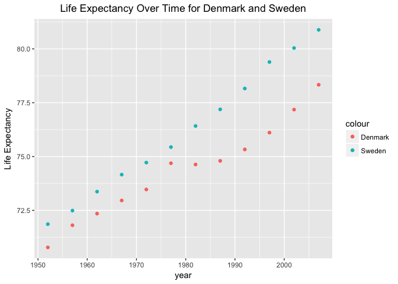
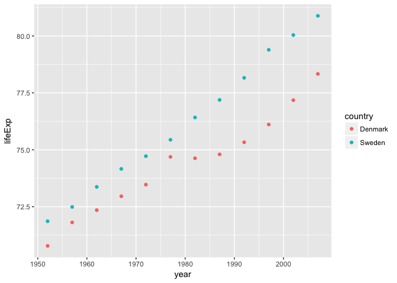
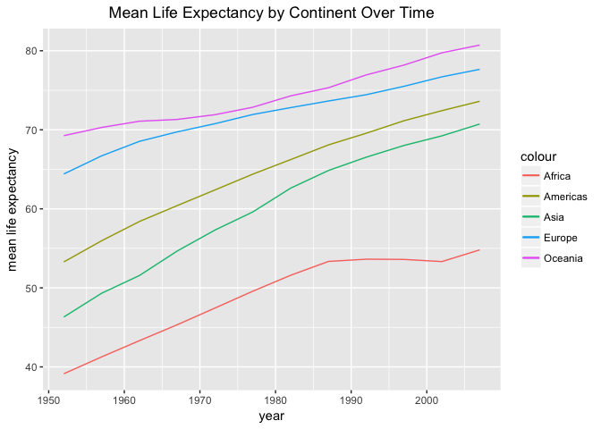
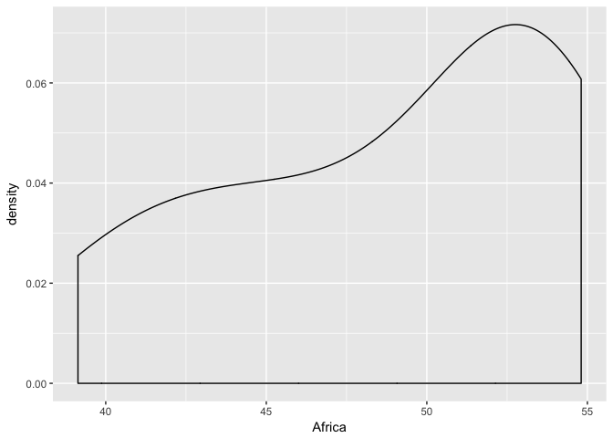
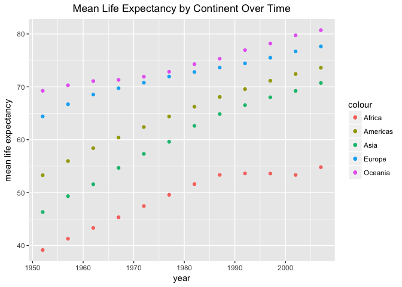
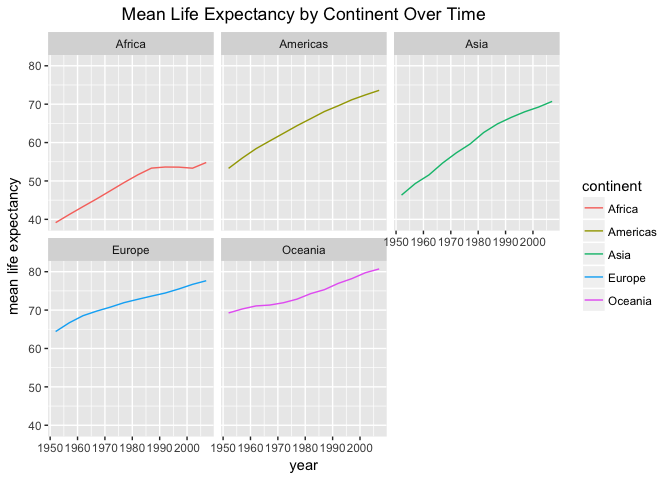
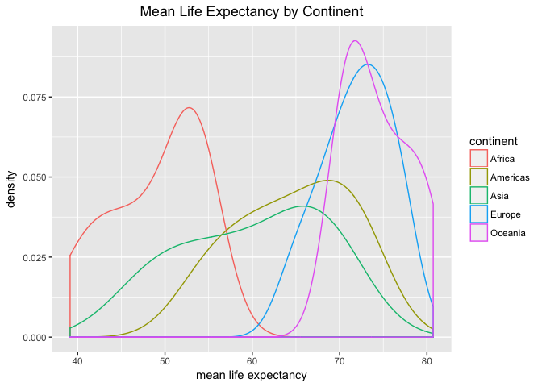

# Hw04
Gb  
2017-10-05  


### For Homework 3: Choose your our own adventure

I opted to do several tasks of both the reshaping and join prompts

***

### Reshaping and Aggregation
#### Activity #1: Make your own cheatsheet

In class we were taught that, generally, `gather` is for creating a long format of a dataframe and `spread` is for creating a wide format

tidyr Function   | Change to Dataframe
-----------------|----------------------------
gather         | long format
spread         | wide format

<br>
When you use the gather function it will look like so: data %>% gather(a, b, ...)
<br>
a= the name of the column headers that becomes a variable
<br>
b= name of stacked columns that becomes a variable
<br>
... = Items that are included or excluded from the reshape
<br>

*Demos*
<br>
New Dataframe
<br>
Lets make a new dataframe which will show three different test scores of 5 individuals


```r
name = c("John", "Jim", "Jack", "Joe", "James")
t1 = c(100, 98, 77, 65, 78)
t2 = c(99, 83, 74, 100, 84)
t3= c(62, 71, 93, 77, 80)
df= data.frame(name, t1, t2, t3)
```


```r
df %>% 
   kable("html") %>% 
  kable_styling(bootstrap_options = c("striped", "hover", "condensed"))
```

<table class="table table-striped table-hover table-condensed" style="margin-left: auto; margin-right: auto;">
<thead><tr>
<th style="text-align:left;"> name </th>
   <th style="text-align:right;"> t1 </th>
   <th style="text-align:right;"> t2 </th>
   <th style="text-align:right;"> t3 </th>
  </tr></thead>
<tbody>
<tr>
<td style="text-align:left;"> John </td>
   <td style="text-align:right;"> 100 </td>
   <td style="text-align:right;"> 99 </td>
   <td style="text-align:right;"> 62 </td>
  </tr>
<tr>
<td style="text-align:left;"> Jim </td>
   <td style="text-align:right;"> 98 </td>
   <td style="text-align:right;"> 83 </td>
   <td style="text-align:right;"> 71 </td>
  </tr>
<tr>
<td style="text-align:left;"> Jack </td>
   <td style="text-align:right;"> 77 </td>
   <td style="text-align:right;"> 74 </td>
   <td style="text-align:right;"> 93 </td>
  </tr>
<tr>
<td style="text-align:left;"> Joe </td>
   <td style="text-align:right;"> 65 </td>
   <td style="text-align:right;"> 100 </td>
   <td style="text-align:right;"> 77 </td>
  </tr>
<tr>
<td style="text-align:left;"> James </td>
   <td style="text-align:right;"> 78 </td>
   <td style="text-align:right;"> 84 </td>
   <td style="text-align:right;"> 80 </td>
  </tr>
</tbody>
</table>
 
*Gather*
<br>
We will use the gather function to make the data frame longer instead of wider and create two new columns called test and scores.  We will do so by excluding the variable we do not want gathered, in this case "nm"
 

```r
df %>% gather(test, scores, -c(name)) %>% 
   kable("html") %>% 
  kable_styling(bootstrap_options = c("striped", "hover", "condensed"))
```

<table class="table table-striped table-hover table-condensed" style="margin-left: auto; margin-right: auto;">
<thead><tr>
<th style="text-align:left;"> name </th>
   <th style="text-align:left;"> test </th>
   <th style="text-align:right;"> scores </th>
  </tr></thead>
<tbody>
<tr>
<td style="text-align:left;"> John </td>
   <td style="text-align:left;"> t1 </td>
   <td style="text-align:right;"> 100 </td>
  </tr>
<tr>
<td style="text-align:left;"> Jim </td>
   <td style="text-align:left;"> t1 </td>
   <td style="text-align:right;"> 98 </td>
  </tr>
<tr>
<td style="text-align:left;"> Jack </td>
   <td style="text-align:left;"> t1 </td>
   <td style="text-align:right;"> 77 </td>
  </tr>
<tr>
<td style="text-align:left;"> Joe </td>
   <td style="text-align:left;"> t1 </td>
   <td style="text-align:right;"> 65 </td>
  </tr>
<tr>
<td style="text-align:left;"> James </td>
   <td style="text-align:left;"> t1 </td>
   <td style="text-align:right;"> 78 </td>
  </tr>
<tr>
<td style="text-align:left;"> John </td>
   <td style="text-align:left;"> t2 </td>
   <td style="text-align:right;"> 99 </td>
  </tr>
<tr>
<td style="text-align:left;"> Jim </td>
   <td style="text-align:left;"> t2 </td>
   <td style="text-align:right;"> 83 </td>
  </tr>
<tr>
<td style="text-align:left;"> Jack </td>
   <td style="text-align:left;"> t2 </td>
   <td style="text-align:right;"> 74 </td>
  </tr>
<tr>
<td style="text-align:left;"> Joe </td>
   <td style="text-align:left;"> t2 </td>
   <td style="text-align:right;"> 100 </td>
  </tr>
<tr>
<td style="text-align:left;"> James </td>
   <td style="text-align:left;"> t2 </td>
   <td style="text-align:right;"> 84 </td>
  </tr>
<tr>
<td style="text-align:left;"> John </td>
   <td style="text-align:left;"> t3 </td>
   <td style="text-align:right;"> 62 </td>
  </tr>
<tr>
<td style="text-align:left;"> Jim </td>
   <td style="text-align:left;"> t3 </td>
   <td style="text-align:right;"> 71 </td>
  </tr>
<tr>
<td style="text-align:left;"> Jack </td>
   <td style="text-align:left;"> t3 </td>
   <td style="text-align:right;"> 93 </td>
  </tr>
<tr>
<td style="text-align:left;"> Joe </td>
   <td style="text-align:left;"> t3 </td>
   <td style="text-align:right;"> 77 </td>
  </tr>
<tr>
<td style="text-align:left;"> James </td>
   <td style="text-align:left;"> t3 </td>
   <td style="text-align:right;"> 80 </td>
  </tr>
</tbody>
</table>
We can also use the gather function and tell it what variables we want to get gathered instead of which not to include like above


```r
df %>% gather(test, scores, t1:t3) %>% 
   kable("html") %>% 
  kable_styling(bootstrap_options = c("striped", "hover", "condensed"))
```

<table class="table table-striped table-hover table-condensed" style="margin-left: auto; margin-right: auto;">
<thead><tr>
<th style="text-align:left;"> name </th>
   <th style="text-align:left;"> test </th>
   <th style="text-align:right;"> scores </th>
  </tr></thead>
<tbody>
<tr>
<td style="text-align:left;"> John </td>
   <td style="text-align:left;"> t1 </td>
   <td style="text-align:right;"> 100 </td>
  </tr>
<tr>
<td style="text-align:left;"> Jim </td>
   <td style="text-align:left;"> t1 </td>
   <td style="text-align:right;"> 98 </td>
  </tr>
<tr>
<td style="text-align:left;"> Jack </td>
   <td style="text-align:left;"> t1 </td>
   <td style="text-align:right;"> 77 </td>
  </tr>
<tr>
<td style="text-align:left;"> Joe </td>
   <td style="text-align:left;"> t1 </td>
   <td style="text-align:right;"> 65 </td>
  </tr>
<tr>
<td style="text-align:left;"> James </td>
   <td style="text-align:left;"> t1 </td>
   <td style="text-align:right;"> 78 </td>
  </tr>
<tr>
<td style="text-align:left;"> John </td>
   <td style="text-align:left;"> t2 </td>
   <td style="text-align:right;"> 99 </td>
  </tr>
<tr>
<td style="text-align:left;"> Jim </td>
   <td style="text-align:left;"> t2 </td>
   <td style="text-align:right;"> 83 </td>
  </tr>
<tr>
<td style="text-align:left;"> Jack </td>
   <td style="text-align:left;"> t2 </td>
   <td style="text-align:right;"> 74 </td>
  </tr>
<tr>
<td style="text-align:left;"> Joe </td>
   <td style="text-align:left;"> t2 </td>
   <td style="text-align:right;"> 100 </td>
  </tr>
<tr>
<td style="text-align:left;"> James </td>
   <td style="text-align:left;"> t2 </td>
   <td style="text-align:right;"> 84 </td>
  </tr>
<tr>
<td style="text-align:left;"> John </td>
   <td style="text-align:left;"> t3 </td>
   <td style="text-align:right;"> 62 </td>
  </tr>
<tr>
<td style="text-align:left;"> Jim </td>
   <td style="text-align:left;"> t3 </td>
   <td style="text-align:right;"> 71 </td>
  </tr>
<tr>
<td style="text-align:left;"> Jack </td>
   <td style="text-align:left;"> t3 </td>
   <td style="text-align:right;"> 93 </td>
  </tr>
<tr>
<td style="text-align:left;"> Joe </td>
   <td style="text-align:left;"> t3 </td>
   <td style="text-align:right;"> 77 </td>
  </tr>
<tr>
<td style="text-align:left;"> James </td>
   <td style="text-align:left;"> t3 </td>
   <td style="text-align:right;"> 80 </td>
  </tr>
</tbody>
</table>

*Spread*
<br>
To spread, we will use the spread function on our previously gathered data.  We can spread by indicating which columns we want to spread.  This will result in our original dataframe


```r
df %>% gather(test, scores, -c(name)) %>% 
  spread(test, scores) %>% 
   kable("html") %>% 
  kable_styling(bootstrap_options = c("striped", "hover", "condensed"))
```

<table class="table table-striped table-hover table-condensed" style="margin-left: auto; margin-right: auto;">
<thead><tr>
<th style="text-align:left;"> name </th>
   <th style="text-align:right;"> t1 </th>
   <th style="text-align:right;"> t2 </th>
   <th style="text-align:right;"> t3 </th>
  </tr></thead>
<tbody>
<tr>
<td style="text-align:left;"> Jack </td>
   <td style="text-align:right;"> 77 </td>
   <td style="text-align:right;"> 74 </td>
   <td style="text-align:right;"> 93 </td>
  </tr>
<tr>
<td style="text-align:left;"> James </td>
   <td style="text-align:right;"> 78 </td>
   <td style="text-align:right;"> 84 </td>
   <td style="text-align:right;"> 80 </td>
  </tr>
<tr>
<td style="text-align:left;"> Jim </td>
   <td style="text-align:right;"> 98 </td>
   <td style="text-align:right;"> 83 </td>
   <td style="text-align:right;"> 71 </td>
  </tr>
<tr>
<td style="text-align:left;"> Joe </td>
   <td style="text-align:right;"> 65 </td>
   <td style="text-align:right;"> 100 </td>
   <td style="text-align:right;"> 77 </td>
  </tr>
<tr>
<td style="text-align:left;"> John </td>
   <td style="text-align:right;"> 100 </td>
   <td style="text-align:right;"> 99 </td>
   <td style="text-align:right;"> 62 </td>
  </tr>
</tbody>
</table>

***

### Reshaping and Aggregation

#### Activity 2: Make a tibble of one row per year and columns of life expectancy for two or more countries

To do this we will need to use the filter function to filter only two countries of interest, the select function to select only the columns we are interested in and then use the spread function to make columns for the life expectancies of the two countries by year.


```r
a2 <- gapminder %>% 
  filter(country %in% c("Sweden","Denmark")) %>% 
  select(year, country, lifeExp) %>% 
  spread(country, lifeExp)
  
a2 %>% 
    kable("html") %>% 
  kable_styling(bootstrap_options = c("striped", "hover", "condensed"))
```

<table class="table table-striped table-hover table-condensed" style="margin-left: auto; margin-right: auto;">
<thead><tr>
<th style="text-align:right;"> year </th>
   <th style="text-align:right;"> Denmark </th>
   <th style="text-align:right;"> Sweden </th>
  </tr></thead>
<tbody>
<tr>
<td style="text-align:right;"> 1952 </td>
   <td style="text-align:right;"> 70.780 </td>
   <td style="text-align:right;"> 71.860 </td>
  </tr>
<tr>
<td style="text-align:right;"> 1957 </td>
   <td style="text-align:right;"> 71.810 </td>
   <td style="text-align:right;"> 72.490 </td>
  </tr>
<tr>
<td style="text-align:right;"> 1962 </td>
   <td style="text-align:right;"> 72.350 </td>
   <td style="text-align:right;"> 73.370 </td>
  </tr>
<tr>
<td style="text-align:right;"> 1967 </td>
   <td style="text-align:right;"> 72.960 </td>
   <td style="text-align:right;"> 74.160 </td>
  </tr>
<tr>
<td style="text-align:right;"> 1972 </td>
   <td style="text-align:right;"> 73.470 </td>
   <td style="text-align:right;"> 74.720 </td>
  </tr>
<tr>
<td style="text-align:right;"> 1977 </td>
   <td style="text-align:right;"> 74.690 </td>
   <td style="text-align:right;"> 75.440 </td>
  </tr>
<tr>
<td style="text-align:right;"> 1982 </td>
   <td style="text-align:right;"> 74.630 </td>
   <td style="text-align:right;"> 76.420 </td>
  </tr>
<tr>
<td style="text-align:right;"> 1987 </td>
   <td style="text-align:right;"> 74.800 </td>
   <td style="text-align:right;"> 77.190 </td>
  </tr>
<tr>
<td style="text-align:right;"> 1992 </td>
   <td style="text-align:right;"> 75.330 </td>
   <td style="text-align:right;"> 78.160 </td>
  </tr>
<tr>
<td style="text-align:right;"> 1997 </td>
   <td style="text-align:right;"> 76.110 </td>
   <td style="text-align:right;"> 79.390 </td>
  </tr>
<tr>
<td style="text-align:right;"> 2002 </td>
   <td style="text-align:right;"> 77.180 </td>
   <td style="text-align:right;"> 80.040 </td>
  </tr>
<tr>
<td style="text-align:right;"> 2007 </td>
   <td style="text-align:right;"> 78.332 </td>
   <td style="text-align:right;"> 80.884 </td>
  </tr>
</tbody>
</table>

Scatterplot life expectancy of one country against that of another
<br>
-To do this we keep year as our x variable and assign our two y variables as two seperate layers of geom_points
<br>
-I also changed the axis title because the default was "Denmark"


```r
a2 %>% 
  ggplot(aes(year)) + 
  geom_point(aes(y=Denmark, colour="Denmark")) + 
  geom_point(aes(y=Sweden, colour="Sweden")) +
  labs(y= "Life Expectancy", title="Life Expectancy Over Time for Denmark and Sweden") +
  theme(plot.title = element_text(hjust = 0.5))
```

<!-- -->

An alternative way to do this would be to ignore the spread function and simply plot from the original gapminder dataset after filtering for the two countries


```r
gapminder %>% 
  filter(country %in% c("Sweden","Denmark")) %>% 
  ggplot(aes(x=year, y=lifeExp)) + geom_point(aes(colour=country))
```

<!-- -->

***
### Reshaping and Aggregation
#### Activity 3: Mean of life expectancy by continent by year, reshape to have own row per year, one variable per continent
Our first task is to use dplyr functions so all we have remaining is the continent, year and mean life expectancy columns.  To do this we first group by continent and year, and then use the summarize function to find the mean life expectancy by year by continent.


```r
a3 <- gapminder %>%
  group_by(continent, year) %>% 
  summarize(meanLE=mean(lifeExp))
a3
```

```
## # A tibble: 60 x 3
## # Groups:   continent [?]
##    continent  year   meanLE
##       <fctr> <int>    <dbl>
##  1    Africa  1952 39.13550
##  2    Africa  1957 41.26635
##  3    Africa  1962 43.31944
##  4    Africa  1967 45.33454
##  5    Africa  1972 47.45094
##  6    Africa  1977 49.58042
##  7    Africa  1982 51.59287
##  8    Africa  1987 53.34479
##  9    Africa  1992 53.62958
## 10    Africa  1997 53.59827
## # ... with 50 more rows
```
Next we want to spread the continent and meanLE data so we only have a single line for each year and multiple columns for each continent


```r
a3 %>% 
  spread(continent, meanLE) %>% 
   kable("html") %>% 
  kable_styling(bootstrap_options = c("striped", "hover", "condensed"))
```

<table class="table table-striped table-hover table-condensed" style="margin-left: auto; margin-right: auto;">
<thead><tr>
<th style="text-align:right;"> year </th>
   <th style="text-align:right;"> Africa </th>
   <th style="text-align:right;"> Americas </th>
   <th style="text-align:right;"> Asia </th>
   <th style="text-align:right;"> Europe </th>
   <th style="text-align:right;"> Oceania </th>
  </tr></thead>
<tbody>
<tr>
<td style="text-align:right;"> 1952 </td>
   <td style="text-align:right;"> 39.13550 </td>
   <td style="text-align:right;"> 53.27984 </td>
   <td style="text-align:right;"> 46.31439 </td>
   <td style="text-align:right;"> 64.40850 </td>
   <td style="text-align:right;"> 69.2550 </td>
  </tr>
<tr>
<td style="text-align:right;"> 1957 </td>
   <td style="text-align:right;"> 41.26635 </td>
   <td style="text-align:right;"> 55.96028 </td>
   <td style="text-align:right;"> 49.31854 </td>
   <td style="text-align:right;"> 66.70307 </td>
   <td style="text-align:right;"> 70.2950 </td>
  </tr>
<tr>
<td style="text-align:right;"> 1962 </td>
   <td style="text-align:right;"> 43.31944 </td>
   <td style="text-align:right;"> 58.39876 </td>
   <td style="text-align:right;"> 51.56322 </td>
   <td style="text-align:right;"> 68.53923 </td>
   <td style="text-align:right;"> 71.0850 </td>
  </tr>
<tr>
<td style="text-align:right;"> 1967 </td>
   <td style="text-align:right;"> 45.33454 </td>
   <td style="text-align:right;"> 60.41092 </td>
   <td style="text-align:right;"> 54.66364 </td>
   <td style="text-align:right;"> 69.73760 </td>
   <td style="text-align:right;"> 71.3100 </td>
  </tr>
<tr>
<td style="text-align:right;"> 1972 </td>
   <td style="text-align:right;"> 47.45094 </td>
   <td style="text-align:right;"> 62.39492 </td>
   <td style="text-align:right;"> 57.31927 </td>
   <td style="text-align:right;"> 70.77503 </td>
   <td style="text-align:right;"> 71.9100 </td>
  </tr>
<tr>
<td style="text-align:right;"> 1977 </td>
   <td style="text-align:right;"> 49.58042 </td>
   <td style="text-align:right;"> 64.39156 </td>
   <td style="text-align:right;"> 59.61056 </td>
   <td style="text-align:right;"> 71.93777 </td>
   <td style="text-align:right;"> 72.8550 </td>
  </tr>
<tr>
<td style="text-align:right;"> 1982 </td>
   <td style="text-align:right;"> 51.59287 </td>
   <td style="text-align:right;"> 66.22884 </td>
   <td style="text-align:right;"> 62.61794 </td>
   <td style="text-align:right;"> 72.80640 </td>
   <td style="text-align:right;"> 74.2900 </td>
  </tr>
<tr>
<td style="text-align:right;"> 1987 </td>
   <td style="text-align:right;"> 53.34479 </td>
   <td style="text-align:right;"> 68.09072 </td>
   <td style="text-align:right;"> 64.85118 </td>
   <td style="text-align:right;"> 73.64217 </td>
   <td style="text-align:right;"> 75.3200 </td>
  </tr>
<tr>
<td style="text-align:right;"> 1992 </td>
   <td style="text-align:right;"> 53.62958 </td>
   <td style="text-align:right;"> 69.56836 </td>
   <td style="text-align:right;"> 66.53721 </td>
   <td style="text-align:right;"> 74.44010 </td>
   <td style="text-align:right;"> 76.9450 </td>
  </tr>
<tr>
<td style="text-align:right;"> 1997 </td>
   <td style="text-align:right;"> 53.59827 </td>
   <td style="text-align:right;"> 71.15048 </td>
   <td style="text-align:right;"> 68.02052 </td>
   <td style="text-align:right;"> 75.50517 </td>
   <td style="text-align:right;"> 78.1900 </td>
  </tr>
<tr>
<td style="text-align:right;"> 2002 </td>
   <td style="text-align:right;"> 53.32523 </td>
   <td style="text-align:right;"> 72.42204 </td>
   <td style="text-align:right;"> 69.23388 </td>
   <td style="text-align:right;"> 76.70060 </td>
   <td style="text-align:right;"> 79.7400 </td>
  </tr>
<tr>
<td style="text-align:right;"> 2007 </td>
   <td style="text-align:right;"> 54.80604 </td>
   <td style="text-align:right;"> 73.60812 </td>
   <td style="text-align:right;"> 70.72848 </td>
   <td style="text-align:right;"> 77.64860 </td>
   <td style="text-align:right;"> 80.7195 </td>
  </tr>
</tbody>
</table>

Plot mean life expectancy by year by continent
<br>
-One way to do this is to introduce each column (the continents) as their own y function (in this case, geom_line). This plot relatively easy to make with the data in this shape.


```r
a3 %>% 
  spread(continent, meanLE) %>% 
  ggplot(aes(year)) +
  geom_line(aes(y=Africa, colour="Africa"))+
  geom_line(aes(y=Americas, colour="Americas"))+
  geom_line(aes(y=Asia, colour="Asia"))+
  geom_line(aes(y=Europe, colour="Europe"))+
  geom_line(aes(y=Oceania, colour="Oceania"))+
  labs(y="mean life expectancy", title= "Mean Life Expectancy by Continent Over Time")+
  theme(plot.title = element_text(hjust = 0.5))
```

<!-- -->

All other plot types(boxplot, columns, lines, scatter) were easier to make with the data before it was reshaped because it originally has a long format, that is, few y variables, which is ideal for using ggplot. Below I tried densityplots and scatterplots with the wide data.  They either did not work or involved extra lines of code to define each column as a seperate Y variable or each plot had to be made seperately to specify each continent as it's own x variable.


```r
a3 %>%
spread(continent, meanLE) %>% 
  ggplot(aes(Africa)) +
  geom_density()
```

<!-- -->


```r
a3 %>% 
  spread(continent, meanLE) %>% 
  ggplot(aes(year)) +
  geom_point(aes(y=Africa, colour="Africa"))+
  geom_point(aes(y=Americas, colour="Americas"))+
  geom_point(aes(y=Asia, colour="Asia"))+
  geom_point(aes(y=Europe, colour="Europe"))+
  geom_point(aes(y=Oceania, colour="Oceania"))+
  labs(y="mean life expectancy", title= "Mean Life Expectancy by Continent Over Time")+
  theme(plot.title = element_text(hjust = 0.5))
```

<!-- -->
  
The lineplot of above is made more easily below with the data before it was reshaped. Also, having plots that are facetted by continent would be easier to make before the data was spread by continent.


```r
a3 %>% 
  ggplot(aes(year, meanLE)) +
  geom_line(aes(colour=continent)) +
  labs(y="mean life expectancy", title= "Mean Life Expectancy by Continent Over Time")+
  theme(plot.title = element_text(hjust = 0.5))
```

<!-- -->
 

```r
a3 %>% 
  ggplot(aes(year, meanLE)) +
  facet_wrap(~continent) + 
  geom_line(aes(colour=continent)) +
  labs(y="mean life expectancy", title= "Mean Life Expectancy by Continent Over Time")+
  theme(plot.title = element_text(hjust = 0.5))
```

<!-- -->

 It was also easier to make a density plot using the long format of the data
 

```r
a3 %>% 
   ggplot(aes(x=meanLE, colour=continent)) +
  geom_density() +
  labs(x="mean life expectancy", title= "Mean Life Expectancy by Continent")+
  theme(plot.title = element_text(hjust = 0.5))
```

<!-- -->
 
 Doing this exercise has really hit home that the shape of your data really matters when it comes to plotting.  Doing this exercise I have observed (and had it confirmed elsewhere on my searchs on how to work with wide datasets) that long dataframes work the best and that gather and melt are the best options if the data is wide and you want to plot it with ease.
 
***
### Join, Merge, Lookup
#### Activity #1: Create a second data frame, complementary to Gapminder. Join.

I decided to challenge myself and make a new dataframe of world capitals.  I used [this](http://rstudio-pubs-static.s3.amazonaws.com/266868_db7146207ddf418a9813947bf6cb5fbf.html) website for guidance on how to make a new dataframe. To do this I installed and loaded the libraries for rvest(easily harvest web pages) and curl (web client for downloads).  Then I used curl to 'scrape' the data off the website below including capitals, latitude and longitude. I made a new dataframe for this data called df1 and displayed the head of the table.


```r
web_content <- read_html(curl('http://www.lab.lmnixon.org/4th/worldcapitals.html', handle = new_handle("useragent" = "Safari/11.0")))
df1 <- (web_content %>% html_table(header=T))[[1]][1:200,]
head(df1)
```

```
##          Country          Capital Latitude Longitude
## 1    Afghanistan            Kabul   34.28N    69.11E
## 2        Albania           Tirane   41.18N    19.49E
## 3        Algeria          Algiers   36.42N    03.08E
## 4 American Samoa        Pago Pago   14.16S   170.43W
## 5        Andorra Andorra la Vella   42.31N    01.32E
## 6         Angola           Luanda   08.50S    13.15E
```


```r
head(gapminder)
```

```
## # A tibble: 6 x 6
##       country continent  year lifeExp      pop gdpPercap
##        <fctr>    <fctr> <int>   <dbl>    <int>     <dbl>
## 1 Afghanistan      Asia  1952  28.801  8425333  779.4453
## 2 Afghanistan      Asia  1957  30.332  9240934  820.8530
## 3 Afghanistan      Asia  1962  31.997 10267083  853.1007
## 4 Afghanistan      Asia  1967  34.020 11537966  836.1971
## 5 Afghanistan      Asia  1972  36.088 13079460  739.9811
## 6 Afghanistan      Asia  1977  38.438 14880372  786.1134
```

Viewing the two dataframes we can see that they both have the column 'country' in common but one is capitalized while the other is not.  To correct this we will use the mutate function on our newly created dataframe so the column header matches the corresponding column in gapminder


```r
df2<- df1 %>% 
mutate(country = Country) %>% 
  select(country, Capital, Latitude, Longitude)
head(df2)
```

```
##          country          Capital Latitude Longitude
## 1    Afghanistan            Kabul   34.28N    69.11E
## 2        Albania           Tirane   41.18N    19.49E
## 3        Algeria          Algiers   36.42N    03.08E
## 4 American Samoa        Pago Pago   14.16S   170.43W
## 5        Andorra Andorra la Vella   42.31N    01.32E
## 6         Angola           Luanda   08.50S    13.15E
```

Now I will try different joins of gapminder with the newly created df2.
<br>
<br>
**Anti-join**
<br>
The first is anti-join, which will drop any countries in gapminder that match with df2.  From this we can see there are several countries in gapminder that either are not in df2 or the naming is incorrect, for example the two Congo countries, Japan, the two Koreas and several others.
<br>
<br>
Reversing the anti-join we can see there are 87 countries in df2 that do not have a match in gapminder due to being excluded or, more likely, mismatching naming conventions.


```r
head(anti_join(gapminder,df2, by="country"))
```

```
## Warning: Column `country` joining factor and character vector, coercing
## into character vector
```

```
## # A tibble: 6 x 6
##   country continent  year lifeExp    pop gdpPercap
##    <fctr>    <fctr> <int>   <dbl>  <int>     <dbl>
## 1 Comoros    Africa  1952  40.715 153936  1102.991
## 2 Comoros    Africa  1957  42.460 170928  1211.149
## 3 Comoros    Africa  1962  44.467 191689  1406.648
## 4 Comoros    Africa  1967  46.472 217378  1876.030
## 5 Comoros    Africa  1972  48.944 250027  1937.578
## 6 Comoros    Africa  1977  50.939 304739  1172.603
```

```r
head(anti_join(df2,gapminder, by="country"))
```

```
## Warning: Column `country` joining character vector and factor, coercing
## into character vector
```

```
##               country          Capital Latitude Longitude
## 1      American Samoa        Pago Pago   14.16S   170.43W
## 2             Andorra Andorra la Vella   42.31N    01.32E
## 3 Antigua and Barbuda      West Indies   17.20N    61.48W
## 4             Armenia          Yerevan   40.10N    44.31E
## 5               Aruba       Oranjestad   12.32N    70.02W
## 6          Azerbaijan             Baku   40.29N    49.56E
```

**Semi-join**
<br>
Semi-join of gapminder with df2 results in a table where there is a row for every row of gapminder that matched with df2. This results in over 1300 rows of matches
<br>
<br>
Semi-join of df2 with gapminder results in 113 rows, where only rows that match for 'country' in gapminder are included.


```r
head(semi_join(gapminder, df2, by="country"))
```

```
## Warning: Column `country` joining factor and character vector, coercing
## into character vector
```

```
## # A tibble: 6 x 6
##       country continent  year lifeExp      pop gdpPercap
##        <fctr>    <fctr> <int>   <dbl>    <int>     <dbl>
## 1 Afghanistan      Asia  1952  28.801  8425333  779.4453
## 2 Afghanistan      Asia  1957  30.332  9240934  820.8530
## 3 Afghanistan      Asia  1962  31.997 10267083  853.1007
## 4 Afghanistan      Asia  1967  34.020 11537966  836.1971
## 5 Afghanistan      Asia  1972  36.088 13079460  739.9811
## 6 Afghanistan      Asia  1977  38.438 14880372  786.1134
```

```r
head(semi_join(df2, gapminder, by="country"))
```

```
## Warning: Column `country` joining character vector and factor, coercing
## into character vector
```

```
##       country      Capital Latitude Longitude
## 1 Afghanistan        Kabul   34.28N    69.11E
## 2     Albania       Tirane   41.18N    19.49E
## 3     Algeria      Algiers   36.42N    03.08E
## 4      Angola       Luanda   08.50S    13.15E
## 5   Argentina Buenos Aires   36.30S    60.00W
## 6   Australia     Canberra   35.15S   149.08E
```

**Inner-join**
<br>
Inner join of gapminder and df2 returns all rows where gapminder has matching values in df2 and includes columns from both dataframes.
<br>
<br>
Inner join of df2 with gapminder returns the exact same table as the inner join above, but with a different order of columns.


```r
head(inner_join(gapminder, df2, by="country"))
```

```
## Warning: Column `country` joining factor and character vector, coercing
## into character vector
```

```
## # A tibble: 6 x 9
##       country continent  year lifeExp      pop gdpPercap Capital Latitude
##         <chr>    <fctr> <int>   <dbl>    <int>     <dbl>   <chr>    <chr>
## 1 Afghanistan      Asia  1952  28.801  8425333  779.4453   Kabul   34.28N
## 2 Afghanistan      Asia  1957  30.332  9240934  820.8530   Kabul   34.28N
## 3 Afghanistan      Asia  1962  31.997 10267083  853.1007   Kabul   34.28N
## 4 Afghanistan      Asia  1967  34.020 11537966  836.1971   Kabul   34.28N
## 5 Afghanistan      Asia  1972  36.088 13079460  739.9811   Kabul   34.28N
## 6 Afghanistan      Asia  1977  38.438 14880372  786.1134   Kabul   34.28N
## # ... with 1 more variables: Longitude <chr>
```

```r
head(inner_join(df2, gapminder, by="country"))
```

```
## Warning: Column `country` joining character vector and factor, coercing
## into character vector
```

```
##       country Capital Latitude Longitude continent year lifeExp      pop
## 1 Afghanistan   Kabul   34.28N    69.11E      Asia 1952  28.801  8425333
## 2 Afghanistan   Kabul   34.28N    69.11E      Asia 1957  30.332  9240934
## 3 Afghanistan   Kabul   34.28N    69.11E      Asia 1962  31.997 10267083
## 4 Afghanistan   Kabul   34.28N    69.11E      Asia 1967  34.020 11537966
## 5 Afghanistan   Kabul   34.28N    69.11E      Asia 1972  36.088 13079460
## 6 Afghanistan   Kabul   34.28N    69.11E      Asia 1977  38.438 14880372
##   gdpPercap
## 1  779.4453
## 2  820.8530
## 3  853.1007
## 4  836.1971
## 5  739.9811
## 6  786.1134
```

**Left-join**
<br>
Left join of gapminder and df2 returns all rows from gapminder and all columns from gapminder and df2. Rows in gapminder with no match in df2 have NA values for the new columns.For example, Comoros has no capital, longitute or latitute listed.
<br>
<br>
Left joining of df2 with gapminder returns all rows from df2 and all columns from df2 and gapminder.  Rows in df2 with no match in gapminder have NA values for the new columns. For example, American Samoa and Andorra have NA values for continent, year etc.


```r
head(left_join(gapminder, df2, group="country"))
```

```
## Joining, by = "country"
```

```
## Warning: Column `country` joining factor and character vector, coercing
## into character vector
```

```
## # A tibble: 6 x 9
##       country continent  year lifeExp      pop gdpPercap Capital Latitude
##         <chr>    <fctr> <int>   <dbl>    <int>     <dbl>   <chr>    <chr>
## 1 Afghanistan      Asia  1952  28.801  8425333  779.4453   Kabul   34.28N
## 2 Afghanistan      Asia  1957  30.332  9240934  820.8530   Kabul   34.28N
## 3 Afghanistan      Asia  1962  31.997 10267083  853.1007   Kabul   34.28N
## 4 Afghanistan      Asia  1967  34.020 11537966  836.1971   Kabul   34.28N
## 5 Afghanistan      Asia  1972  36.088 13079460  739.9811   Kabul   34.28N
## 6 Afghanistan      Asia  1977  38.438 14880372  786.1134   Kabul   34.28N
## # ... with 1 more variables: Longitude <chr>
```


```r
head(left_join(df2, gapminder, by="country"))
```

```
## Warning: Column `country` joining character vector and factor, coercing
## into character vector
```

```
##       country Capital Latitude Longitude continent year lifeExp      pop
## 1 Afghanistan   Kabul   34.28N    69.11E      Asia 1952  28.801  8425333
## 2 Afghanistan   Kabul   34.28N    69.11E      Asia 1957  30.332  9240934
## 3 Afghanistan   Kabul   34.28N    69.11E      Asia 1962  31.997 10267083
## 4 Afghanistan   Kabul   34.28N    69.11E      Asia 1967  34.020 11537966
## 5 Afghanistan   Kabul   34.28N    69.11E      Asia 1972  36.088 13079460
## 6 Afghanistan   Kabul   34.28N    69.11E      Asia 1977  38.438 14880372
##   gdpPercap
## 1  779.4453
## 2  820.8530
## 3  853.1007
## 4  836.1971
## 5  739.9811
## 6  786.1134
```

**Right-join**
<br>
Right join of gapminder and df2 returns all rows from df2 and all columns from gapminder and df2.Rows in gapminder with no match in df2 have NA values for the new columns.For example, Armenia is only in df2 and is included with NA for all the gapminder columns.
<br>
<br>
Right joining of df2 with gapminder returns all rows from gapminder and all columns from df2 and gapminder.  Rows in gapminder with no match in df2 have NA values for the new columns. For example, the Republic of Congo has NA for capital, longituge and latitude.


```r
head(right_join(gapminder, df2, group="country"))
```

```
## Joining, by = "country"
```

```
## Warning: Column `country` joining factor and character vector, coercing
## into character vector
```

```
## # A tibble: 6 x 9
##       country continent  year lifeExp      pop gdpPercap Capital Latitude
##         <chr>    <fctr> <int>   <dbl>    <int>     <dbl>   <chr>    <chr>
## 1 Afghanistan      Asia  1952  28.801  8425333  779.4453   Kabul   34.28N
## 2 Afghanistan      Asia  1957  30.332  9240934  820.8530   Kabul   34.28N
## 3 Afghanistan      Asia  1962  31.997 10267083  853.1007   Kabul   34.28N
## 4 Afghanistan      Asia  1967  34.020 11537966  836.1971   Kabul   34.28N
## 5 Afghanistan      Asia  1972  36.088 13079460  739.9811   Kabul   34.28N
## 6 Afghanistan      Asia  1977  38.438 14880372  786.1134   Kabul   34.28N
## # ... with 1 more variables: Longitude <chr>
```

```r
head(right_join(df2, gapminder, group="country"))
```

```
## Joining, by = "country"
```

```
## Warning: Column `country` joining character vector and factor, coercing
## into character vector
```

```
##       country Capital Latitude Longitude continent year lifeExp      pop
## 1 Afghanistan   Kabul   34.28N    69.11E      Asia 1952  28.801  8425333
## 2 Afghanistan   Kabul   34.28N    69.11E      Asia 1957  30.332  9240934
## 3 Afghanistan   Kabul   34.28N    69.11E      Asia 1962  31.997 10267083
## 4 Afghanistan   Kabul   34.28N    69.11E      Asia 1967  34.020 11537966
## 5 Afghanistan   Kabul   34.28N    69.11E      Asia 1972  36.088 13079460
## 6 Afghanistan   Kabul   34.28N    69.11E      Asia 1977  38.438 14880372
##   gdpPercap
## 1  779.4453
## 2  820.8530
## 3  853.1007
## 4  836.1971
## 5  739.9811
## 6  786.1134
```

**Full-Join**
<br>
Full join of gapminder and df2 returns all rows and all columns for both x and y. Value that don't match appear as NA.  Full join yields the same results regardless of dataframe order in the function, although the column order may be different.


```r
head(full_join(gapminder, df2, by="country"))
```

```
## Warning: Column `country` joining factor and character vector, coercing
## into character vector
```

```
## # A tibble: 6 x 9
##       country continent  year lifeExp      pop gdpPercap Capital Latitude
##         <chr>    <fctr> <int>   <dbl>    <int>     <dbl>   <chr>    <chr>
## 1 Afghanistan      Asia  1952  28.801  8425333  779.4453   Kabul   34.28N
## 2 Afghanistan      Asia  1957  30.332  9240934  820.8530   Kabul   34.28N
## 3 Afghanistan      Asia  1962  31.997 10267083  853.1007   Kabul   34.28N
## 4 Afghanistan      Asia  1967  34.020 11537966  836.1971   Kabul   34.28N
## 5 Afghanistan      Asia  1972  36.088 13079460  739.9811   Kabul   34.28N
## 6 Afghanistan      Asia  1977  38.438 14880372  786.1134   Kabul   34.28N
## # ... with 1 more variables: Longitude <chr>
```

### Activity #3: Explore merge and match
*Merge*


```r
head(merge(gapminder, df2))
```

```
##       country continent year lifeExp      pop gdpPercap Capital Latitude
## 1 Afghanistan      Asia 1982  39.854 12881816  978.0114   Kabul   34.28N
## 2 Afghanistan      Asia 1987  40.822 13867957  852.3959   Kabul   34.28N
## 3 Afghanistan      Asia 1962  31.997 10267083  853.1007   Kabul   34.28N
## 4 Afghanistan      Asia 1967  34.020 11537966  836.1971   Kabul   34.28N
## 5 Afghanistan      Asia 1977  38.438 14880372  786.1134   Kabul   34.28N
## 6 Afghanistan      Asia 2007  43.828 31889923  974.5803   Kabul   34.28N
##   Longitude
## 1    69.11E
## 2    69.11E
## 3    69.11E
## 4    69.11E
## 5    69.11E
## 6    69.11E
```

Looking at the table from the merge function, I noticed that it simply discarded any rows that did not match from df2 into gapminder. For example, the country of Iran exists both in df2 and gapminder but in df2 it is listed as Iran(Islamic Republic of). Therefore all rows with NA appear to be discarded and do not appear.  We should also test this by switching the order of the dataframes to make sure that does not affect the function. When comparing to the joins, the merge function appears to be similar to inner join.  Both return all rows from x where there is a matching value in y and columns of x and y.


```r
head(merge(df2, gapminder))
```

```
##       country Capital Latitude Longitude continent year lifeExp      pop
## 1 Afghanistan   Kabul   34.28N    69.11E      Asia 1982  39.854 12881816
## 2 Afghanistan   Kabul   34.28N    69.11E      Asia 1987  40.822 13867957
## 3 Afghanistan   Kabul   34.28N    69.11E      Asia 1962  31.997 10267083
## 4 Afghanistan   Kabul   34.28N    69.11E      Asia 1967  34.020 11537966
## 5 Afghanistan   Kabul   34.28N    69.11E      Asia 1977  38.438 14880372
## 6 Afghanistan   Kabul   34.28N    69.11E      Asia 2007  43.828 31889923
##   gdpPercap
## 1  978.0114
## 2  852.3959
## 3  853.1007
## 4  836.1971
## 5  786.1134
## 6  974.5803
```
This merged table appears to be identical to the one above.
<br>
<br>
*Match*

```r
match(4, c(2,3,5,4), nomatch=NA_integer_, incomparables = NULL)
```

```
## [1] 4
```
The concept of match is that it returns a vector of the position of first occurrence of vector 1 in vector 2.  If no element of vector 1 exists in vector, NA is returned.


```r
match(6, c(2,3,5,4), nomatch=NA_integer_, incomparables = NULL)
```

```
## [1] NA
```
The function match looks for where elements of x match those of y.  It only reports the first occurence of each element of x and NA for no match.  This can be demonstrated using slightly more complicated vectors.


```r
xx <-c(1,4,5,80)
yy <- c(2, 5, 7, 6, 9, 5, 4, 14, 2, 3, 8, 11, 1, 13)
match(xx, yy)
```

```
## [1] 13  7  2 NA
```
In the above match we can see that first element of x (the number 1) matches at position 13, 4 matches at position 7, five matches at position 2 (even though there is a second 5 in the yy vector is not considered) and there is not match in 80.  We can compare this to joins and merges
<br>
Below we can see that merging the two created a new table where every value of x is matched to each value of y.


```r
head(merge(xx,yy))
```

```
##    x y
## 1  1 2
## 2  4 2
## 3  5 2
## 4 80 2
## 5  1 5
## 6  4 5
```

***
#### Reflections
- I thought this assignment was interesting with some new challenges
- I found it really helpful to visualize all the different types of joins
- I also enjoyed trying the curl function to scrape data from a table on a website
- It was interesting to try out the merge and match functions and I hope to explore them more in the future


