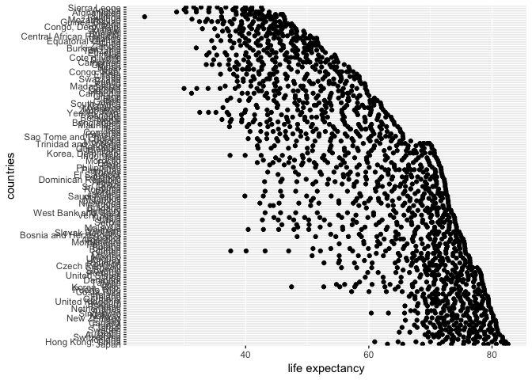
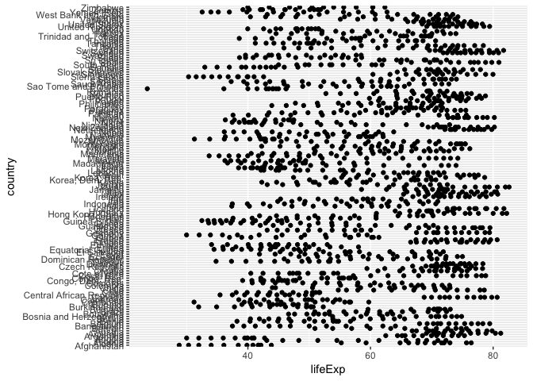
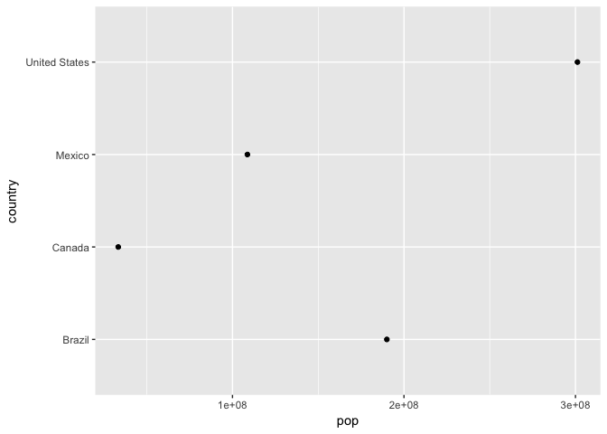
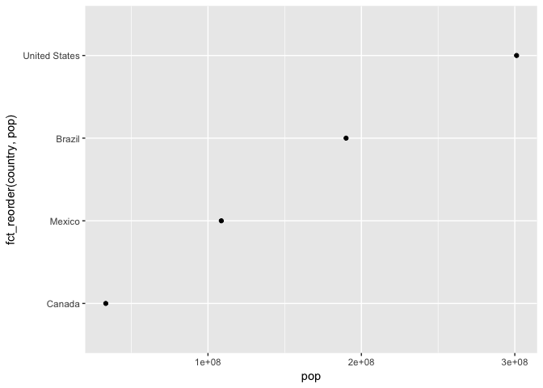
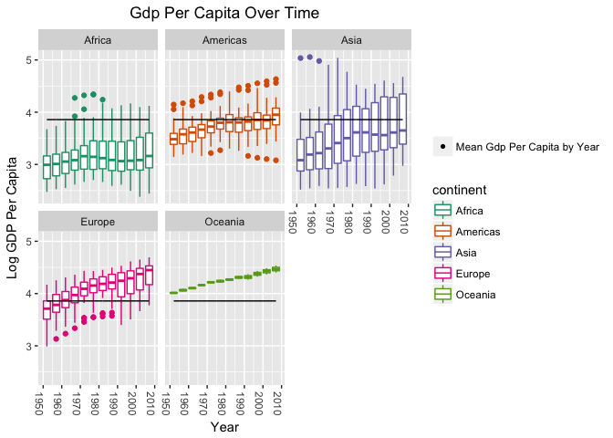
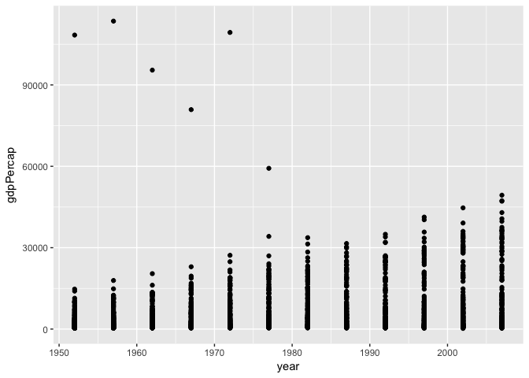

# Hw05
Gb  
2017-10-17  
## Table of Contents

### Factor Management

### File I/O

### Visualization and Design

### Write Figures to File

### Clean Up Your Repo!

### But I Want To Do More


For this assignment I chose to focus on the gapminder dataset.

I began with loading the libraries that I would need:

```r
library(tidyr)
library(dplyr)
library(knitr)
library(kableExtra)
library(gapminder)
library(tidyverse)
library(forcats)
library(plyr)
```
***
### Factor Management
#### Task 1-Drop Oceania

<a href="#top">Back to top</a>

To do this let's first take a glimpse of the dataset


```r
glimpse(gapminder)
```

```
## Observations: 1,704
## Variables: 6
## $ country   <fctr> Afghanistan, Afghanistan, Afghanistan, Afghanistan,...
## $ continent <fctr> Asia, Asia, Asia, Asia, Asia, Asia, Asia, Asia, Asi...
## $ year      <int> 1952, 1957, 1962, 1967, 1972, 1977, 1982, 1987, 1992...
## $ lifeExp   <dbl> 28.801, 30.332, 31.997, 34.020, 36.088, 38.438, 39.8...
## $ pop       <int> 8425333, 9240934, 10267083, 11537966, 13079460, 1488...
## $ gdpPercap <dbl> 779.4453, 820.8530, 853.1007, 836.1971, 739.9811, 78...
```

```r
str(gapminder$continent)
```

```
##  Factor w/ 5 levels "Africa","Americas",..: 3 3 3 3 3 3 3 3 3 3 ...
```

```r
fct_count(gapminder$continent)
```

```
## # A tibble: 5 x 2
##          f     n
##     <fctr> <int>
## 1   Africa   624
## 2 Americas   300
## 3     Asia   396
## 4   Europe   360
## 5  Oceania    24
```

One way to do this would be to create a list of continents we wish to keep and filter gapminder to include only these continents. Another way would be to subset gapminder to include all continents excluding Oceania.  However, after doing either of these methods if we look at the newly created dataframe nooc_gap we can see that there are still 5 levels for continents whereas we would like to only have 4.


```r
no_OC <-c("Asia", "Africa", "Europe", "Americas")
nooc_gap <-gapminder %>% 
  filter(continent %in% no_OC)
str(nooc_gap)
```

```
## Classes 'tbl_df', 'tbl' and 'data.frame':	1680 obs. of  6 variables:
##  $ country  : Factor w/ 142 levels "Afghanistan",..: 1 1 1 1 1 1 1 1 1 1 ...
##  $ continent: Factor w/ 5 levels "Africa","Americas",..: 3 3 3 3 3 3 3 3 3 3 ...
##  $ year     : int  1952 1957 1962 1967 1972 1977 1982 1987 1992 1997 ...
##  $ lifeExp  : num  28.8 30.3 32 34 36.1 ...
##  $ pop      : int  8425333 9240934 10267083 11537966 13079460 14880372 12881816 13867957 16317921 22227415 ...
##  $ gdpPercap: num  779 821 853 836 740 ...
```

```r
nlevels(nooc_gap$continent)
```

```
## [1] 5
```

To get rid of the extra level we need to use the forcats function `fct_drop`


```r
nooc_gap$continent %>% 
  fct_drop() %>% 
  levels()
```

```
## [1] "Africa"   "Americas" "Asia"     "Europe"
```

or we can use the base function `droplevels` to operate on all factors in the dataframe


```r
nooc_gap_dropped <- nooc_gap %>%
  droplevels()
nlevels(nooc_gap_dropped$continent)
```

```
## [1] 4
```

Now we only have 4 levels of factors in continents left.  We can confirm this by taking a glimpse of our new dataframe `nooc_gap_dropped`. From the structure we can see that we dropped a level from continent and the 2 countries under Oceania were dropped from country, leaving only 140 from the original 142.  We can also check this with `fct_count`.


```r
str(nooc_gap_dropped)
```

```
## Classes 'tbl_df', 'tbl' and 'data.frame':	1680 obs. of  6 variables:
##  $ country  : Factor w/ 140 levels "Afghanistan",..: 1 1 1 1 1 1 1 1 1 1 ...
##  $ continent: Factor w/ 4 levels "Africa","Americas",..: 3 3 3 3 3 3 3 3 3 3 ...
##  $ year     : int  1952 1957 1962 1967 1972 1977 1982 1987 1992 1997 ...
##  $ lifeExp  : num  28.8 30.3 32 34 36.1 ...
##  $ pop      : int  8425333 9240934 10267083 11537966 13079460 14880372 12881816 13867957 16317921 22227415 ...
##  $ gdpPercap: num  779 821 853 836 740 ...
```

```r
fct_count(nooc_gap_dropped$continent)
```

```
## # A tibble: 4 x 2
##          f     n
##     <fctr> <int>
## 1   Africa   624
## 2 Americas   300
## 3     Asia   396
## 4   Europe   360
```

#### Task 2- Reorder the levels of country or continent

Based on a principled summary of one of the quantitative variables.
<br>
For this task I decided to look at maximum life expectancy for every country and re-order them based on highest to lowest


```r
f1<- fct_reorder(gapminder$country, gapminder$lifeExp, max, .desc=TRUE) 
  f1 %>% levels() %>% head()
```

```
## [1] "Japan"            "Hong Kong, China" "Iceland"         
## [4] "Switzerland"      "Australia"        "Spain"
```
 We can also visualize this data on a scatterplot

```r
plot1 <- gapminder %>% 
  ggplot(aes(x=lifeExp, y=fct_reorder(country, lifeExp, max, .desc=TRUE))) + geom_point() + labs(x="life expectancy", y="countries")
plot1
```

<!-- -->

As we can see from the plot above, the countries with the highest life expectancies on the plot are those we saw at the head of the table just previous (Japan, Hong Kong etc.)

#### Task 3-Common Part
##### Practice writing to file and reading back in

Let's practice writing out the dataframe we created in Task#1, `nooc_gap_dropped`
<br>
To do this let's use the readr `write_csv()` to get a comma delimited file.  I chose readr over the base function because it has nicer default behaviour, althought this doesn't matter for data that is as clean as Gapminder

```r
readr::write_csv(nooc_gap_dropped, "nooc_gap_dropped.csv")
```

To take a look at the exported csv file I used `readr::read_csv` and looked at the head of the table.   We can see that column specification is attempted. While country and continent are factors in the original tibble, the imported tibble reads them as characters. This can be easily fixed with the `mutate` function.


```r
head(readr::read_csv("nooc_gap_dropped.csv"))
```

```
## Parsed with column specification:
## cols(
##   country = col_character(),
##   continent = col_character(),
##   year = col_integer(),
##   lifeExp = col_double(),
##   pop = col_integer(),
##   gdpPercap = col_double()
## )
```

```
## # A tibble: 6 x 6
##       country continent  year lifeExp      pop gdpPercap
##         <chr>     <chr> <int>   <dbl>    <int>     <dbl>
## 1 Afghanistan      Asia  1952  28.801  8425333  779.4453
## 2 Afghanistan      Asia  1957  30.332  9240934  820.8530
## 3 Afghanistan      Asia  1962  31.997 10267083  853.1007
## 4 Afghanistan      Asia  1967  34.020 11537966  836.1971
## 5 Afghanistan      Asia  1972  36.088 13079460  739.9811
## 6 Afghanistan      Asia  1977  38.438 14880372  786.1134
```

```r
str(nooc_gap_dropped)
```

```
## Classes 'tbl_df', 'tbl' and 'data.frame':	1680 obs. of  6 variables:
##  $ country  : Factor w/ 140 levels "Afghanistan",..: 1 1 1 1 1 1 1 1 1 1 ...
##  $ continent: Factor w/ 4 levels "Africa","Americas",..: 3 3 3 3 3 3 3 3 3 3 ...
##  $ year     : int  1952 1957 1962 1967 1972 1977 1982 1987 1992 1997 ...
##  $ lifeExp  : num  28.8 30.3 32 34 36.1 ...
##  $ pop      : int  8425333 9240934 10267083 11537966 13079460 14880372 12881816 13867957 16317921 22227415 ...
##  $ gdpPercap: num  779 821 853 836 740 ...
```

Reading the imported csv we can see that dropping of the Oceania factor is retained.  Because there was no reordering of levels in Task 1, we can not judge if reordered factors were retained upon import.  We do know from the class lecture and notes that using `saveRDS` and `readRDS` are the best way to save and re-import data to retain factor levels upon re-import.


```r
csv_nooc <- readr::read_csv("nooc_gap_dropped.csv")
```

```
## Parsed with column specification:
## cols(
##   country = col_character(),
##   continent = col_character(),
##   year = col_integer(),
##   lifeExp = col_double(),
##   pop = col_integer(),
##   gdpPercap = col_double()
## )
```

```r
fct_count(csv_nooc$continent)
```

```
## # A tibble: 4 x 2
##          f     n
##     <fctr> <int>
## 1   Africa   624
## 2 Americas   300
## 3     Asia   396
## 4   Europe   360
```

##### Characterize the (derived) data before and after your factor re-leveling
For this I used the factor re-leveling from task 2 which ordered countries by maximum life expectancy
<br>

##### Explore the effects of arrange
Unfactored data
<br>
Using arrange on this data we see the descending order


```r
dervieddata <-gapminder %>% 
  group_by(country) %>% 
  select(country, lifeExp) %>% 
 arrange(desc(lifeExp))
  head(dervieddata) %>% kable("html") %>% 
  kable_styling(bootstrap_options = c("striped", "hover", "condensed"))
```

<table class="table table-striped table-hover table-condensed" style="margin-left: auto; margin-right: auto;">
<thead><tr>
<th style="text-align:left;"> country </th>
   <th style="text-align:right;"> lifeExp </th>
  </tr></thead>
<tbody>
<tr>
<td style="text-align:left;"> Japan </td>
   <td style="text-align:right;"> 82.603 </td>
  </tr>
<tr>
<td style="text-align:left;"> Hong Kong, China </td>
   <td style="text-align:right;"> 82.208 </td>
  </tr>
<tr>
<td style="text-align:left;"> Japan </td>
   <td style="text-align:right;"> 82.000 </td>
  </tr>
<tr>
<td style="text-align:left;"> Iceland </td>
   <td style="text-align:right;"> 81.757 </td>
  </tr>
<tr>
<td style="text-align:left;"> Switzerland </td>
   <td style="text-align:right;"> 81.701 </td>
  </tr>
<tr>
<td style="text-align:left;"> Hong Kong, China </td>
   <td style="text-align:right;"> 81.495 </td>
  </tr>
</tbody>
</table>
 
 Plotting the derived data after arrange
 

```r
dervieddata %>% 
  ggplot(aes(lifeExp, country)) + geom_point()
```

<!-- -->

After looking at plots of the un-leveled data after using the arrange function we can see that it doesn't have any affect on the figure


```r
max_LE <- fct_reorder(gapminder$country, gapminder$lifeExp, max, .desc=TRUE) %>% 
  levels()
max_LE %>% head()
```

```
## [1] "Japan"            "Hong Kong, China" "Iceland"         
## [4] "Switzerland"      "Australia"        "Spain"
```

```r
str(max_LE)
```

```
##  chr [1:142] "Japan" "Hong Kong, China" "Iceland" "Switzerland" ...
```

##### Effects of re-ordering a factor and factor reordering coupled with arrange
Let's reorder the factors of some newly derived data and couple it with arrange.

After making our new dataframe NAFTA_gap we can see that the current levels are alphabetical.  We can then use `fct_relevel` to change the order of the levels.


```r
NAFTA_gap <- gapminder %>%
  filter(country %in% c("Canada","United States", "Mexico", "Brazil"), year %in% c(2007)) %>% 
  select(country, year, pop) %>% 
  droplevels()
NAFTA_gap %>% kable("html") %>% 
  kable_styling(bootstrap_options = c("striped", "hover", "condensed"))
```

<table class="table table-striped table-hover table-condensed" style="margin-left: auto; margin-right: auto;">
<thead><tr>
<th style="text-align:left;"> country </th>
   <th style="text-align:right;"> year </th>
   <th style="text-align:right;"> pop </th>
  </tr></thead>
<tbody>
<tr>
<td style="text-align:left;"> Brazil </td>
   <td style="text-align:right;"> 2007 </td>
   <td style="text-align:right;"> 190010647 </td>
  </tr>
<tr>
<td style="text-align:left;"> Canada </td>
   <td style="text-align:right;"> 2007 </td>
   <td style="text-align:right;"> 33390141 </td>
  </tr>
<tr>
<td style="text-align:left;"> Mexico </td>
   <td style="text-align:right;"> 2007 </td>
   <td style="text-align:right;"> 108700891 </td>
  </tr>
<tr>
<td style="text-align:left;"> United States </td>
   <td style="text-align:right;"> 2007 </td>
   <td style="text-align:right;"> 301139947 </td>
  </tr>
</tbody>
</table>

```r
levels(NAFTA_gap$country)
```

```
## [1] "Brazil"        "Canada"        "Mexico"        "United States"
```

```r
NAFTA_gap %>% ggplot(aes(pop,country)) +geom_point()
```

<!-- -->

```r
ggplot(NAFTA_gap, aes(x=pop, y=fct_reorder(country, pop))) + geom_point()
```

<!-- -->

```r
NAFTA_gap %>% 
  arrange(desc(pop)) %>% 
  ggplot(aes(x=pop, y=fct_reorder(country, pop))) + geom_point()
```

<!-- -->
Despite using arrange() for descending population the figure still showed the order from the fct_reorder, that is, lowest population first

***
### File I/O
#### RDS

<a href="#top">Back to top</a>

As I already provided an example of `write csv` and `read csv` above, I decided to tackle rds.

First I filtered the gapminder data for lowest gdp and changed the factors to make them in ascending order


```r
gap_life_gdp <- fct_reorder(gapminder$country, gapminder$gdpPercap, min)
gap_life_gdp %>% levels() %>% head()
```

```
## [1] "Congo, Dem. Rep." "Lesotho"          "Guinea-Bissau"   
## [4] "Eritrea"          "Myanmar"          "Burundi"
```

Next I saved the newly created dataframe to file in the rds format


```r
saveRDS(gap_life_gdp, "gap_life_gdp.rds")
```

Now we want to reimport this file and see what survived.


```r
gap_life_gdp <- readRDS("gap_life_gdp.rds")
gap_life_gdp %>% levels() %>% head()
```

```
## [1] "Congo, Dem. Rep." "Lesotho"          "Guinea-Bissau"   
## [4] "Eritrea"          "Myanmar"          "Burundi"
```
Here we can see that our reordered country factor levels survived export and import!

***
### Visualization and design

<a href="#top">Back to top</a>

Create a new figure, juxtapose first attempt

For this challenge I decided to take a figure I made back for homework #2


```r
ggplot(gapminder, aes(x=year, y=gdpPercap)) + geom_point()
```

<!-- -->

To make this figure look nicer I did the following: changed the y scale to log 10, changed from points to boxplots (to be more informative), faceted by continent, updated the axis and figure titles, added a better colour scale using brewer and changed the angle of the x axis markers to be less crowded.  To try something fun I decided to include an line for the world mean for every year of the plot so we can see how the continents do over time compared to the average.  For this I first needed to add a new variable to the database, grouped by year, that I called meangdp. I had some issues adding this new line to the legend, and after much troubleshooting and help from [this thread](https://stackoverflow.com/questions/26756358/how-to-include-in-legend-symbol-of-mean-in-boxplot-with-ggplot), I managed to add a second legend for my averaged line.  I found fiddling with the legend to be really helpful in learning how to manage with multiple lines/points/etc on the same plot which I'm sure will be helpful in the future!


```r
gap2<- gapminder %>%
  group_by(year) %>% 
  select(continent,year, gdpPercap) %>% 
  mutate(meangdp=mean(gdpPercap))
head(gap2) %>% kable("html") %>% 
  kable_styling(bootstrap_options = c("striped", "hover", "condensed"))
```

<table class="table table-striped table-hover table-condensed" style="margin-left: auto; margin-right: auto;">
<thead><tr>
<th style="text-align:left;"> continent </th>
   <th style="text-align:right;"> year </th>
   <th style="text-align:right;"> gdpPercap </th>
   <th style="text-align:right;"> meangdp </th>
  </tr></thead>
<tbody>
<tr>
<td style="text-align:left;"> Asia </td>
   <td style="text-align:right;"> 1952 </td>
   <td style="text-align:right;"> 779.4453 </td>
   <td style="text-align:right;"> 7215.327 </td>
  </tr>
<tr>
<td style="text-align:left;"> Asia </td>
   <td style="text-align:right;"> 1957 </td>
   <td style="text-align:right;"> 820.8530 </td>
   <td style="text-align:right;"> 7215.327 </td>
  </tr>
<tr>
<td style="text-align:left;"> Asia </td>
   <td style="text-align:right;"> 1962 </td>
   <td style="text-align:right;"> 853.1007 </td>
   <td style="text-align:right;"> 7215.327 </td>
  </tr>
<tr>
<td style="text-align:left;"> Asia </td>
   <td style="text-align:right;"> 1967 </td>
   <td style="text-align:right;"> 836.1971 </td>
   <td style="text-align:right;"> 7215.327 </td>
  </tr>
<tr>
<td style="text-align:left;"> Asia </td>
   <td style="text-align:right;"> 1972 </td>
   <td style="text-align:right;"> 739.9811 </td>
   <td style="text-align:right;"> 7215.327 </td>
  </tr>
<tr>
<td style="text-align:left;"> Asia </td>
   <td style="text-align:right;"> 1977 </td>
   <td style="text-align:right;"> 786.1134 </td>
   <td style="text-align:right;"> 7215.327 </td>
  </tr>
</tbody>
</table>


```r
p<- ggplot(gap2, aes(x=year, y=log10(gdpPercap))) + 
  facet_wrap(~continent) + 
  geom_boxplot(aes(group=year, colour=continent)) + 
  scale_colour_brewer(palette="Dark2") +
  theme(axis.text.x=element_text (angle=270)) +
  labs(y="Log GDP Per Capita", x= "Year", title="Gdp Per Capita Over Time") +
  theme(plot.title = element_text(hjust = 0.5)) +
  geom_line(aes(x=year, y=log10(meangdp))) +
   geom_point(aes(shape = "Mean Gdp Per Capita by Year"), alpha = 0) +
  guides(shape=guide_legend(title=NULL, override.aes = list(alpha = 1)))
p
```

<!-- -->

***
### Writing Figures to File
##### Use ggsave

<a href="#top">Back to top</a>

I saved my previous plot to the variable `p` for this exercise for in a png and pdf format.  I also played around with the width/height, text scaling, formats, and explicit provisions.


```r
ggsave("my_plotscale2.pdf", width=12, height=6, scale=2, p)
ggsave("my_plotscale1.pdf", width=12, height=6, scale=1, p)
ggsave("my_plot.png",width=12, height=6, p)
```
Scaling to [2](https://github.com/gbraich/STAT545-hw-Braich-Gurneet/blob/master/hw05/hw05_figures_tables/my_plotscale2.pdf) makes the pdf look really weird to let's scale try the other way.  Scaling it to [0.5](https://github.com/gbraich/STAT545-hw-Braich-Gurneet/blob/master/hw05/hw05_figures_tables/my_plotscale0.5.pdf) makes the figures quite small compared to the legends and other text.

```r
ggsave("my_plotscale0.5.pdf", width=12, height=6, scale=0.5, p)
```


```r
ggsave("my_plot.pdf", width=12, height=6, scale=2, p)
```

Expliciting stating which plot can be important because if plot= ? is not stated, ggsave will default to the last plot displayed.

For example, if we bring up the last two plots we worked with from above, and use ggsave it will save the last plot displayed, even though that is the rudimentary plot from hw2 that we don't want to save.  As you can see, [the last plot display is saved](https://github.com/gbraich/STAT545-hw-Braich-Gurneet/blob/master/hw05/hw05_figures_tables/noexplicitname_plot.pdf)


```r
p<- ggplot(gap2, aes(x=year, y=log10(gdpPercap))) + 
  facet_wrap(~continent) + 
  geom_boxplot(aes(group=year, colour=continent)) + 
  scale_colour_brewer(palette="Dark2") +
  theme(axis.text.x=element_text (angle=270)) +
  labs(y="Log GDP Per Capita", x= "Year", title="Gdp Per Capita Over Time") +
  theme(plot.title = element_text(hjust = 0.5)) +
  geom_line(aes(x=year, y=log10(meangdp))) +
   geom_point(aes(shape = "Mean Gdp Per Capita by Year"), alpha = 0) +
  guides(shape=guide_legend(title=NULL, override.aes = list(alpha = 1)))
p
```

<!-- -->

```r
ggplot(gapminder, aes(x=year, y=gdpPercap)) + geom_point()
```

<!-- -->

```r
ggsave("noexplicitname_plot.pdf")
```

```
## Saving 7 x 5 in image
```

***
### Clean Up Your Repo

<a href="#top">Back to top</a>

-Created a table of contents in the top-level [README](https://github.com/gbraich/STAT545-hw-Braich-Gurneet/blob/master/README.md)
<br>
-Renamed homework assignments for future reference
<br>
-Included a description of what was covered in each assignment
<br>
-Removed all downstream stuff and re-rendered everything
<br>

***
### But I want to do more!

<a href="#top">Back to top</a>

Gapminder version
<br>
I decided to go about this task in two ways: one way by using `join` and the second by using the `ifelse` functions
<br>
Try 1
I elected to add information on the leader of each nation and whether they were male or female. One approach to this is to first filter gapminder to include just the countries of interest.  Then create a new dataframe that includes the countries of interest and the gender of the countries' leader.  I used semi-join join this with filtered gapminder tibble.  I then reordered the levels of factors using fct_infreq so the most frequent factor would appear first.  


```r
leaders <- gapminder %>% 
  filter(country %in% c("Germany", "Japan", "Chile", "Switzerland", "Canada", "China")) %>% 
  select(country)
head(leaders)%>% kable("html") %>% 
  kable_styling(bootstrap_options = c("striped", "hover", "condensed"))
```

<table class="table table-striped table-hover table-condensed" style="margin-left: auto; margin-right: auto;">
<thead><tr>
<th style="text-align:left;"> country </th>
  </tr></thead>
<tbody>
<tr>
<td style="text-align:left;"> Canada </td>
  </tr>
<tr>
<td style="text-align:left;"> Canada </td>
  </tr>
<tr>
<td style="text-align:left;"> Canada </td>
  </tr>
<tr>
<td style="text-align:left;"> Canada </td>
  </tr>
<tr>
<td style="text-align:left;"> Canada </td>
  </tr>
<tr>
<td style="text-align:left;"> Canada </td>
  </tr>
</tbody>
</table>


```r
country = c("Germany", "Chile", "Japan", "Canada", "Switzerland", "China")
leadergender = c("female", "female", "male", "male", "male", "male")
df= data.frame(country, leadergender)
```


```r
leaders2 <- semi_join(df, leaders, by="country")
```

```
## Warning: Column `country` joining factors with different levels, coercing
## to character vector
```

```r
leaders2 %>% kable("html") %>% 
  kable_styling(bootstrap_options = c("striped", "hover", "condensed"))
```

<table class="table table-striped table-hover table-condensed" style="margin-left: auto; margin-right: auto;">
<thead><tr>
<th style="text-align:left;"> country </th>
   <th style="text-align:left;"> leadergender </th>
  </tr></thead>
<tbody>
<tr>
<td style="text-align:left;"> Germany </td>
   <td style="text-align:left;"> female </td>
  </tr>
<tr>
<td style="text-align:left;"> Chile </td>
   <td style="text-align:left;"> female </td>
  </tr>
<tr>
<td style="text-align:left;"> Japan </td>
   <td style="text-align:left;"> male </td>
  </tr>
<tr>
<td style="text-align:left;"> Canada </td>
   <td style="text-align:left;"> male </td>
  </tr>
<tr>
<td style="text-align:left;"> Switzerland </td>
   <td style="text-align:left;"> male </td>
  </tr>
<tr>
<td style="text-align:left;"> China </td>
   <td style="text-align:left;"> male </td>
  </tr>
</tbody>
</table>

Let's see the structure of this new dataframe


```r
str(leaders2)
```

```
## 'data.frame':	6 obs. of  2 variables:
##  $ country     : Factor w/ 6 levels "Canada","Chile",..: 4 2 5 1 6 3
##  $ leadergender: Factor w/ 2 levels "female","male": 1 1 2 2 2 2
```

```r
levels(leaders2$leadergender)
```

```
## [1] "female" "male"
```

Now let's reorder these levels for frequency


```r
leaders3 <- leaders2$leadergender %>% 
  fct_infreq()
leaders3 %>% 
  levels()
```

```
## [1] "male"   "female"
```


From this we can see that the factors have been reordered in terms of highest frequency (male) instead of alphabetically.
<br>
<br>
Try 2
Filter to only the countries we are interested, drop extra levels, create a new variable (languages), map exisiting country factor levels to new levels


```r
languages <- gapminder %>% 
  filter(country %in% c("Germany", "Japan", "Chile", "Austria", "Canada", "Argentina"), year %in% c(2007)) %>% 
  select(country) %>% 
  droplevels()
languages %>% kable("html") %>% 
  kable_styling(bootstrap_options = c("striped", "hover", "condensed"))
```

<table class="table table-striped table-hover table-condensed" style="margin-left: auto; margin-right: auto;">
<thead><tr>
<th style="text-align:left;"> country </th>
  </tr></thead>
<tbody>
<tr>
<td style="text-align:left;"> Argentina </td>
  </tr>
<tr>
<td style="text-align:left;"> Austria </td>
  </tr>
<tr>
<td style="text-align:left;"> Canada </td>
  </tr>
<tr>
<td style="text-align:left;"> Chile </td>
  </tr>
<tr>
<td style="text-align:left;"> Germany </td>
  </tr>
<tr>
<td style="text-align:left;"> Japan </td>
  </tr>
</tbody>
</table>

```r
str(languages)
```

```
## Classes 'tbl_df', 'tbl' and 'data.frame':	6 obs. of  1 variable:
##  $ country: Factor w/ 6 levels "Argentina","Austria",..: 1 2 3 4 5 6
```

We are going to make a new variable called languages and map our countries to it.  We can see that after mapping our langauges we get an alphabetical list.  After converting our newly created column to factors we can reorder the factors from alphabetical to frequency.


```r
languages$language <- ifelse(languages$country == "Argentina", "Spanish",
                             ifelse(languages$country == "Chile", "Spanish",
                             ifelse(languages$country == "Canada", "English",
                             ifelse(languages$country == "Austria", "German",
                                    ifelse(languages$country == "Germany", "German",
                             ifelse(languages$country == "Japan", "Japanese", NA))))))
lang2 <-languages %>% 
  mutate(langfactor=as.factor(language)) %>% 
  select(country, langfactor)
lang2 %>% kable("html") %>% 
  kable_styling(bootstrap_options = c("striped", "hover", "condensed"))
```

<table class="table table-striped table-hover table-condensed" style="margin-left: auto; margin-right: auto;">
<thead><tr>
<th style="text-align:left;"> country </th>
   <th style="text-align:left;"> langfactor </th>
  </tr></thead>
<tbody>
<tr>
<td style="text-align:left;"> Argentina </td>
   <td style="text-align:left;"> Spanish </td>
  </tr>
<tr>
<td style="text-align:left;"> Austria </td>
   <td style="text-align:left;"> German </td>
  </tr>
<tr>
<td style="text-align:left;"> Canada </td>
   <td style="text-align:left;"> English </td>
  </tr>
<tr>
<td style="text-align:left;"> Chile </td>
   <td style="text-align:left;"> Spanish </td>
  </tr>
<tr>
<td style="text-align:left;"> Germany </td>
   <td style="text-align:left;"> German </td>
  </tr>
<tr>
<td style="text-align:left;"> Japan </td>
   <td style="text-align:left;"> Japanese </td>
  </tr>
</tbody>
</table>

```r
str(lang2)
```

```
## Classes 'tbl_df', 'tbl' and 'data.frame':	6 obs. of  2 variables:
##  $ country   : Factor w/ 6 levels "Argentina","Austria",..: 1 2 3 4 5 6
##  $ langfactor: Factor w/ 4 levels "English","German",..: 4 2 1 4 2 3
```

```r
lang2$langfactor %>% 
  fct_infreq()
```

```
## [1] Spanish  German   English  Spanish  German   Japanese
## Levels: German Spanish English Japanese
```


